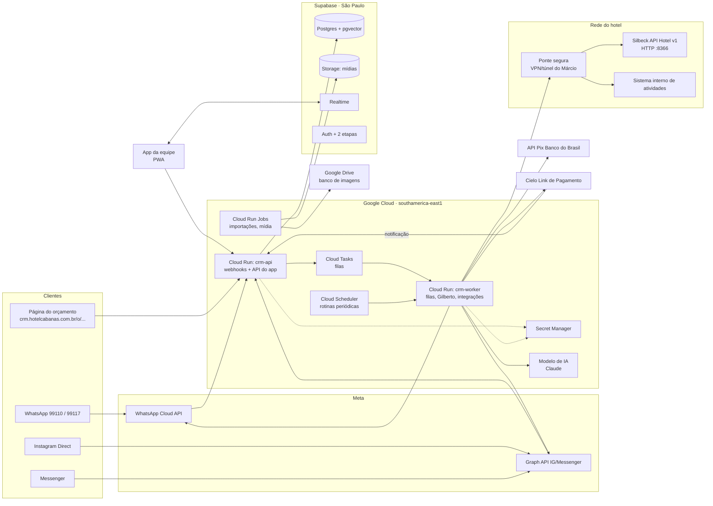

# CRM Cabanas: especificação técnica (v1)

> **Data:** 01/10/2026 · **Status:** rascunho para aprovação do dono (próximo passo 2b.1 de `proximos-passos.md`).
> **Fontes:** `crm/entrevista.md` (P1–P58, D1–D16), `funcionalidades.md`, `analise-jornada.md` (G1–G16), `analise-critica.md`, `silbeck-api-detalhes.md` e `silbeck/mapa-ids.md`, `upsell-catalogo.md`, `whatsapp-coexistencia.md`, `identidade-ui.md`, `gilberto/base-conhecimento.md`, `.claude/agents/gilberto-vendas.md`, `contexto/hotel-operacional.md` e o protótipo `crm/prototipo/crm-cabanas.html` (v30).
> **Como ler:** cada seção começa com um **Resumo para o dono** (sem termos técnicos). O detalhe técnico vem logo abaixo, para quem vai construir.
> **Convenções:** "[a confirmar]" = fato ou número que ainda não temos; "[confirmar preços atuais]" = preço de terceiro que muda; "Decisão Pxx/Dxx/Gxx" = de onde veio a regra. Nada aqui contém senha, chave ou dado de hóspede.

---

## Sumário
1. Objetivo e escopo
2. Arquitetura
3. Modelo de dados
4. Telas
5. Integrações
6. Gilberto em produção
7. Regras de negócio
8. Segurança e LGPD
9. Testes e critérios de aceite por fase
10. Custos estimados
11. Riscos, pendências e decisões em aberto

---

## 1. Objetivo e escopo

> **Resumo para o dono.** O CRM é o sistema do próprio hotel para **vender e atender** pelo WhatsApp (99110 e 99117), pelo direct do Instagram e pelo Messenger, numa caixa de entrada só. Ele cuida do **antes** (conversa, orçamento, reserva, pagamento do sinal) e do **depois** da estadia (pré-chegada, avaliação, convite para voltar). **Não substitui o Silbeck**: o Silbeck continua sendo o dono das reservas, dos preços e das vagas; o CRM conversa com ele. O Gilberto (agente de IA) atende junto com a equipe. Tudo é construído em 4 fases, nessa ordem, e a Asksuite só sai no fim, depois dos testes.

### 1.1 Objetivos mensuráveis
- Todo lead com **origem registrada** (P8, P9) e o faturamento por origem visível (P10, D14).
- **Reserva direta paga** pelo WhatsApp com menos trabalho manual: orçamento com preço do Silbeck, reserva no aceite (P46), Pix BB ou link Cielo com baixa automática (P31, P32).
- **Ninguém esquecido:** alertas com prioridade, plantão e escalonamento (P52, D9–D11); follow-up dentro das regras da Meta (P12).
- **Custo mensal na faixa da Asksuite** (cerca de R$ 800, P20), com o custo real visível no painel.
- Ajudar a meta de **60% de ocupação**, com foco em domingo a quinta e baixa temporada (`analise-critica.md`).

### 1.2 O que entra em cada fase (ordem aprovada em P18; detalhe em `proximos-passos.md` §4)

| Fase | Entra | Itens de `funcionalidades.md` |
|---|---|---|
| **0. Fundação** (pré-requisito, sem uso pela equipe) | Projeto Google Cloud (D16), Supabase de teste e de produção, app "Cabanas CRM" na Meta com número de teste, Secret Manager, login, esqueleto do webhook, simulador do Silbeck ligado | — |
| **1. Caixa única e funil** | WhatsApp (número de teste → 99117 por coexistência em **modo observação**), Instagram Direct e Messenger; contatos e negócios (G5); funil com arrastar e soltar; ficha do cliente; tarefas; nova conversa por modelo; respostas rápidas "/"; alertas, sino, plantão e push; consentimento; links rastreáveis; usuários e papéis; auditoria; importação de contatos (D1) | 1.1–1.10, 2.1–2.7, 2.9–2.12, 3.1, 4.1, 4.3–4.6, 4.8, 4.9, 8.1–8.5, 9.5 (etapa e prazos, sem cobrança automática ainda) |
| **2. Gilberto em treino e painel** | Gilberto em modo **sugestão** e **revisão depois**; Biblioteca, Questionário, Fonte de conhecimento, Regras; "Testar o agente" e bateria de testes; banco de imagens completo (476 fotos + vídeos) com etiquetas; follow-up; painel de métricas; agências sincronizadas; catálogo de produtos; e-mail de reservas no CRM (D13) | 1.11, 1.13, 2.13, 3.2, 3.3, 4.2, 4.7, 5.1–5.4, 5.6–5.14, 6.1–6.7, 7.3, 10.1, 10.2, 10.5 |
| **3. Silbeck e pagamentos** | Vagas, orçamento e página do orçamento, reserva no aceite, Pix BB, link Cielo, adiantamento, "Reservas a receber", sincronização de reservas (motor, Booking, agências, balcão), status Hospedado, régua de pré e pós-estadia, upsell com reserva de atividades, massagem pela parceira, pré-check-in | 1.6, 2.8, 3.4, 5.5, 7.1, 7.2, 7.4, 9.1–9.4, 9.6, 9.7, 10.3, 10.4 |
| **4. Gilberto sozinho à noite e saída da Asksuite** | Modo **automático** das 17h às 7h30 depois de 90% de acerto (P14, P15, P21); migração do 99110 para a conta em reais (P58); cancelamento da Asksuite | — |

### 1.3 Fora do escopo (por decisão ou por limite da API)
- **Cancelar ou alterar reserva pela API:** não existe no Silbeck (`silbeck-api-detalhes.md` §3). A equipe faz no Silbeck; o CRM só **lê** o resultado.
- **Lançar consumo/upsell na conta do hóspede:** a API só lê. Vira tarefa de 1 clique.
- **Cadastrar agência no Silbeck:** só leitura; pré-cadastro + tarefa (P42).
- **Dados de cartão:** o CRM nunca recebe, mostra ou guarda (P34). Cobrança das reservas do Booking continua fora do CRM.
- **Desconto, brinde ou condição especial pelo Gilberto** (P13).
- **Depósito bancário e boleto** (`hotel-operacional.md` §9).
- **Funis separados** (item 1.12, cortado pelo dono).
- **Alterar tarifário do Silbeck** (`POST /v1/Tarifario`): proibido; a permissão nem deve ser liberada.
- **Fora até nova decisão:** avaliações do Google/TripAdvisor (B3), comissão das agências (B4) e prioridade do lead (A8) ficam para depois da fase 4.

---

## 2. Arquitetura

> **Resumo para o dono.** São quatro peças: (1) o **aplicativo** que a equipe abre no computador ou instala no celular; (2) o **servidor** no Google Cloud Run (São Paulo), que recebe as mensagens da Meta, conversa com o Silbeck, o Banco do Brasil e a Cielo, e roda o Gilberto; (3) o **banco de dados** no Supabase (São Paulo), onde ficam contatos, conversas, orçamentos e o espelho das reservas; (4) a **ponte segura** com o servidor do Silbeck dentro do hotel, montada pelo Márcio. Senhas e chaves ficam só no cofre do Google (Secret Manager). Toda mensagem que chega é **gravada primeiro e processada depois**, para nada se perder se algo cair.

### 2.1 Diagrama geral

### 2.2 Componentes

| Componente | Tecnologia (proposta) | Responsabilidade |
|---|---|---|
| **App da equipe** | Aplicativo web instalável (PWA), TypeScript + framework de interface [a escolher na construção], tokens de `crm/tokens.css` e regras de `identidade-ui.md` | Todas as telas do §4; recebe atualizações ao vivo pelo Supabase Realtime; notificação push (Web Push) |
| **crm-api** (Cloud Run, serviço público) | Node.js/TypeScript [proposta; a confirmar] | Webhooks (Meta, Cielo, BB se usado), API do app, página pública do orçamento e do pré-check-in. Responde rápido: grava o evento bruto e enfileira |
| **crm-worker** (Cloud Run, serviço privado, só chamado pelo Cloud Tasks/Scheduler com identidade do Google) | Mesmo código, outro ponto de entrada | Processa filas: Gilberto, envio de mensagens, Silbeck, Pix, Cielo, régua, alertas e escalonamento |
| **Cloud Run Jobs** | Mesmo código | Tarefas longas: importar base de hóspedes do Silbeck (A5/D1), sincronizar o Drive, gerar miniaturas e versões leves de vídeo, purga de retenção |
| **Cloud Tasks** | Filas nomeadas (§2.4) | Entrega garantida, retentativas com espera crescente, limite de paralelismo por fila |
| **Cloud Scheduler** | Rotinas cron (§2.5) | Sincronizações periódicas e relógio dos prazos |
| **Supabase** | Postgres 15+ com `pgvector`, Auth, Storage, Realtime; projeto exclusivo, região São Paulo (P24, P25) | Dados, login com 2 etapas, arquivos, atualização ao vivo, RLS por papel |
| **Secret Manager** | Google Cloud | Todas as credenciais (Meta, Silbeck, BB + certificado, Cielo, IA, Drive, chaves de push). Lidas pelo servidor na inicialização; nunca no repositório, nunca no chat |
| **Ponte Silbeck** | VPN/túnel do Márcio (decisão P57) | Liga o Cloud Run ao servidor local `192.168.132.242:8366` sem expor a API na internet (ver §5.2.1) |
| **Modelo de IA** | API da Anthropic (Claude) — ver §6.1 | Gilberto: entender, decidir e escrever |
| **MCP** | Opcional, só interno | Se fizer sentido, as ferramentas do Gilberto (§6.3) podem ser expostas como um servidor MCP **interno** para testes e para a equipe de IA; o canal do WhatsApp **não** usa MCP (P45) |

**Domínio:** `crm.hotelcabanas.com.br` apontado para o Cloud Run (mapeamento de domínio ou balanceador). Caminhos públicos: `/o/{token}` (orçamento), `/f/{token}` (pré-check-in), `/webhooks/*`. Todo o resto exige login.

### 2.3 Fluxo de uma mensagem do WhatsApp até a resposta

1. **Cliente envia** "Oi, quero preço para 15 a 17 de novembro, somos 2" no 99117.
2. **Meta chama** `POST /webhooks/meta` no crm-api.
3. crm-api **confere a assinatura** `X-Hub-Signature-256` (HMAC com o segredo do app). Inválida → 401 e registro de segurança.
4. Grava o corpo bruto em `eventos_entrada` com chave de idempotência (`wamid` da mensagem ou id do status). Repetido → ignora. Responde **200 em menos de 1 s** (a Meta reenvia se demorar ou falhar).
5. Enfileira `processar-evento` (Cloud Tasks).
6. crm-worker **normaliza**: acha ou cria o `contato` pelo telefone; acha a `conversa` aberta do canal; grava a `mensagem` (texto, mídia, botão, `referral` de anúncio); baixa mídia para o Storage; atualiza a janela de 24 h; dispara Realtime (a mensagem aparece na tela da equipe).
7. **Origem:** se veio `referral` (anúncio de clique para WhatsApp) ou código de link rastreável no texto, grava a origem no `negocio` (P9, A7).
8. **Roteamento** (§6.4): conversa assumida por alguém? Número em modo observação? Agência? Hospedado? Horário do Gilberto? Mensagem enviada pela equipe fora do CRM há pouco (G13)? Decide entre: só registrar · sugerir resposta · responder sozinho.
9. Se o Gilberto vai agir: **agrupamento** — agenda `gilberto-turno` para daqui a N segundos (padrão 12 s, editável). Cada nova mensagem do cliente nesse intervalo **reinicia o relógio** (as mensagens seguidas viram um turno só).
10. **Turno do Gilberto:** monta o contexto (instruções de `crm/gilberto/prompt-sistema.md`, regras publicadas, ficha, histórico), chama o modelo com as ferramentas (§6.3). As ferramentas consultam Silbeck/banco de imagens etc.; os guarda-corpos (§6.5) validam tudo antes.
11. **Envio humanizado:** marca como lida e mostra "digitando…"; espera um tempo proporcional ao tamanho de cada balão; envia 1 a 3 balões (separados por `---` na saída do modelo) pela Cloud API; grava cada `mensagem` com autor "gilberto" e as fontes usadas ("Ver fonte da resposta").
12. **Status** (enviado, entregue, lido, falhou) chegam pelo mesmo webhook e atualizam a mensagem. Falha → retentativa (§2.4) ou alerta.

Em modo **sugestão**, o passo 11 vira: grava a resposta como `sugestao` e mostra na conversa com ✅ Enviar · ✏️ Editar e enviar · ❌ Descartar (P15).

### 2.4 Filas e reprocessamento

| Fila (Cloud Tasks) | O que faz | Paralelismo | Retentativas |
|---|---|---|---|
| `processar-evento` | Normaliza eventos da Meta, Cielo, BB | 10 | até 10, espera crescente (1 s → 5 min) |
| `gilberto-turno` | Um turno do Gilberto por conversa (chave = conversa; nunca dois turnos da mesma conversa ao mesmo tempo, garantido por trava no banco) | 5 | 3; depois, **passa para a equipe** com alerta "Gilberto falhou" e avisa o cliente de forma honesta |
| `enviar-mensagem` | Envio para Meta | 5 por número [ajustar ao limite da Meta] | até 8 em erro temporário (429/5xx); erro permanente (ex.: fora da janela, número inválido) → marca falha e mostra na tela |
| `silbeck` | Toda chamada ao Silbeck | **2** (proteger o servidor do hotel) [a confirmar com o Márcio] | 5 em erro de rede; **nunca** repetir `POST reserva` ou `POST Adiantamento` às cegas (ver §5.2.5) |
| `pagamentos` | Criar/consultar/anular cobranças BB e Cielo | 3 | 5 |
| `regua` | Envios programados | 3 | 5 |
| `alertas` | Disparo, repetição e escalonamento de alertas, push | 5 | 5 |

- **Idempotência:** toda tarefa leva uma chave única (`evento_id`, `cobranca_id+acao` etc.) gravada em `jobs_execucao`; reexecução de algo já concluído não repete o efeito.
- **Caixa de saída (outbox):** ações que mexem no mundo externo são gravadas como "pendente" na mesma transação do banco que as originou e depois executadas. Assim, uma queda entre "gravar" e "enviar" não perde nem duplica.
- **Fila morta:** tarefa que esgota as tentativas vai para `jobs_falhos`, aparece em **Ajustes → Saúde do sistema** com botão "Reprocessar" (só papel TI/dono).
- **Reprocessar eventos:** `eventos_entrada` guarda o corpo bruto por 30 dias, permitindo reprocessar um período depois de corrigir um erro.

### 2.5 Rotinas periódicas (Cloud Scheduler)

| Rotina | Frequência | Detalhe |
|---|---|---|
| Relógio de prazos e alertas | a cada 1 min | Prazos de pagamento, lembretes, escalonamento de 10 min, tarefas vencidas, follow-up, fila da manhã às 7h30 |
| Reservas novas/alteradas no Silbeck | a cada 5 min | `ListaReserva` por `tipoData=cadastro` (janela móvel) + reconsulta das reservas ativas do CRM (status, adiantamentos, cancelamento `status=3`) — P33 |
| Pix recebidos no BB | a cada 2 min [ajustável] | Consulta das cobranças abertas e dos Pix recebidos (ver §5.3) |
| Estadias | a cada 15 min | `ListaEstadia` (status Hospedado, check-out) — B1 |
| Vagas (cache) | a cada 15 min e sob demanda | `Disponibilidade` dos próximos 60 dias para o mapa de vagas (A4) |
| Agências | a cada 1 h | `GET /v1/Empresa` (P42) |
| Drive (banco de imagens) | 1 vez ao dia + botão | Arquivos novos/alterados (P51) |
| Resumo semanal | segunda, 7h | Resumo do painel (6.6) |
| Custo do mês | 1 vez ao dia | Soma Meta + IA + infraestrutura; alerta em 80% do teto (C3) |
| Purga de retenção | 1 vez ao dia | Apaga o que passou de 5 anos (D15) |
| Coexistência | 1 vez ao dia | Lembra a recepção se o app do 99117 não foi aberto há 12 dias (a Meta desconecta com 14) |

### 2.6 Ambientes

| Ambiente | Onde | WhatsApp | Silbeck | Pagamentos | Quem usa |
|---|---|---|---|---|---|
| **Desenvolvimento** | Máquina do desenvolvedor + Supabase local | Respostas gravadas (gravações de webhooks) | **Simulador** (`crm/simulador-silbeck/`, outra equipe) | Simulado | Equipe de construção |
| **Teste** | Cloud Run `crm-teste` + Supabase projeto **"cabanas-crm-teste"** | **Número de teste gratuito da Meta** (até 5 celulares cadastrados) e, se preciso, chip de teste | **Simulador** para gravações; **leituras** podem ir ao Silbeck real pela ponte (a Silbeck confirmou que leituras não alteram nada) | Sandbox da Cielo [a confirmar se há]; Pix BB em homologação [a confirmar] | Equipe + dono |
| **Produção** | Cloud Run `crm` + Supabase **"cabanas-crm"** (Pro) | 99117 (coexistência) e, na fase 4, 99110 | Silbeck real | BB e Cielo reais | Hotel |

- Cada ambiente tem **seus próprios segredos** no Secret Manager; o teste nunca tem credenciais de produção de gravação no Silbeck, BB ou Cielo.
- **Testes reais controlados no Silbeck** (gravação): só em produção, com reserva "TESTE CRM" em data distante, autorizados e acompanhados pela equipe, que cancela no Silbeck em seguida (P57).
- Publicação: código no GitHub → testes automáticos → imagem → **teste** → aprovação → **produção** (mesma imagem). Migrações de banco versionadas e aplicadas antes da nova versão.

---

## 3. Modelo de dados

> **Resumo para o dono.** O banco separa a **pessoa** (contato, com todo o histórico, para sempre) dos **negócios** (cada pedido de estadia; G5). Uma pessoa pode ter vários negócios ao longo dos anos. As reservas do Silbeck ficam **espelhadas** (cópia para consulta e painel; o Silbeck continua sendo a verdade). Cada usuário só vê o que o papel dele permite: por exemplo, faturamento só para o dono, a Renata e o Márcio (D14). Tudo o que alguém muda fica registrado (auditoria).

### 3.1 Convenções
- Chave primária `id uuid` em todas as tabelas; `criado_em`, `atualizado_em timestamptz` (fuso America/Campo_Grande na exibição; gravação em UTC).
- Dinheiro em **centavos** (`bigint`), nunca `float`.
- Exclusão lógica (`ativo`/`excluido_em`) onde a tela permite "desativar sem apagar"; exclusão física só na purga LGPD.
- Telefones no formato E.164 (`+5567...`).
- Toda tabela com dados de cliente tem **RLS ligada**. O servidor usa a chave de serviço apenas nas filas; o app usa o login do usuário.

### 3.2 Pessoas, usuários e papéis

| Tabela | Campos principais | Chaves e índices |
|---|---|---|
| `usuarios` | id (= id do Supabase Auth), nome, e-mail, papel, ativo, recebe_alertas (bool), telefone_alertas (para modelo interno, opcional), preferências (menu recolhido, painel aberto) | único(e-mail) |
| `papeis` (enum) | `dono`, `gestor` (Renata), `ti` (Márcio), `atendente` (Jagles e outros), `recepcao` | — |
| `plantao` | usuario_id, inicio, fim (null = atual), definido_por | índice(fim) parcial "atual" |
| `setores` | nome, destino (D12: só **Recepção**), ativo | — |

Permissões por papel (resumo; matriz completa no §8.3):

| Ação | dono | gestor | ti | atendente | recepcao |
|---|---|---|---|---|---|
| Ver conversas e funil | ✔ | ✔ | ✔ | ✔ | ✔ (Hospedados) |
| Ver **faturamento** e valores agregados (D14) | ✔ | ✔ | ✔ | ✘ | ✘ |
| Ver painel (P10) | ✔ | ✔ | ✔ | ✔ sem faturamento | ✘ |
| Receber alertas (D10) | conforme `recebe_alertas` (hoje: **Márcio, Jagles, Ricardo**) |||||
| Apagar contato/negócio | ✔ | ✔ | ✘ | ✘ | ✘ |
| Publicar mudanças do Gilberto, ligar modo automático | ✔ | ✔ [a confirmar] | ✘ | ✘ | ✘ |
| Saúde do sistema, reprocessar | ✔ | ✘ | ✔ | ✘ | ✘ |

> Ricardo é o **dono** (Ricardo Constantino): administrador, recebe alertas (D10) e vê faturamento (D14).

### 3.3 Contatos, negócios e conversas

| Tabela | Campos principais | Chaves e índices |
|---|---|---|
| `contatos` | nome, sobrenome, data_nascimento, cidade, uf, observacoes, perfil (casal, familia, grupo, 55mais, aves, …), perfil_detectado_por (gilberto/usuario), etiquetas[], agencia_id (se for contato de agência), hospede_silbeck_id, mesclado_em_id (junção), excluido_em | índice(nome trigram), índice(hospede_silbeck_id) |
| `contato_identificadores` | contato_id, tipo (`whatsapp`, `telefone`, `email`, `ig_scoped_id`, `psid_messenger`), valor normalizado, verificado | **único(tipo, valor)** — base da junção de duplicados (2.11, P19) |
| `consentimentos` | contato_id, finalidade (`marketing`), status (sim/não/descadastrado), canal_origem (orçamento, pré-check-in, balcão, "SAIR"), texto_pedido, registrado_em, registrado_por | índice(contato_id, finalidade) |
| `negocios` (o "card" do funil; G5) | contato_id, etapa (Novo, Em atendimento, Orçamento enviado, Aguardando pagamento, Reservado, Perdido; etapas editáveis na fase 2), responsavel_id, origem_real, origem_detalhe (campanha, ad_id, código do link, quem indicou), canal_entrada, data_entrada, data_saida, adultos, criancas_idades int[], acomodacao_desejada, valor_previsto, motivo_perda (lista fixa + outro; inclui "não pagou", "cancelou depois de pagar", "sem vaga"), lista_espera (bool), agencia_id, fechado_em | índice(etapa, atualizado_em), índice(responsavel_id), índice(contato_id) |
| `negocio_historico` | negocio_id, campo, de, para, por (usuário/gilberto/sistema), quando | índice(negocio_id) |
| `conversas` | contato_id, negocio_id (atual), canal (`wa`, `ig`, `fb`, `email`), numero_id (99110/99117/teste), status (aberta/resolvida/arquivada), atribuida_a, modo_gilberto (`herdar`, `desligado`, `sugestao`, `automatico`), gilberto_pausado_ate, ultima_msg_cliente_em (janela 24 h), nao_lidas, etiquetas[] | índice(status, ultima_msg_cliente_em desc), índice(atribuida_a) |
| `mensagens` | conversa_id, direcao (entrada/saída), autor (cliente, usuario_id, gilberto, sistema, app_externo), tipo (texto, imagem, video, audio, documento, localizacao, botao, modelo, reacao, nota_interna), corpo, midia_id, modelo_id, id_externo (wamid/mid), status_entrega, erro, transcricao (áudio), fontes_usadas jsonb (Gilberto), sugestao_status (pendente/enviada/editada/descartada + motivo), enviada_em | **único(id_externo)**, índice(conversa_id, enviada_em) |
| `midias_mensagem` | mensagem_id, caminho_storage, mime, tamanho, sha256 | — |
| `tarefas` | negocio_id/contato_id, tipo (ligar, enviar proposta, follow-up, cancelar no Silbeck, cadastrar agência, lançar consumo, cobrar Booking, agendar massagem, agendar atividade (boia/arvorismo), devolução, alteração), titulo, vence_em, responsavel_id, status, criada_por (usuário/sistema/gilberto), dados jsonb (nº reserva, valor) | índice(responsavel_id, status, vence_em) |
| `links_rastreaveis` | codigo (ex.: `AG-ECOTRIP`, `IG-BIO`), destino (wa.me 99117/99110, motor), origem_real, campanha, criado_por, cliques | único(codigo) |
| `lista_espera` | negocio_id, data_entrada, data_saida, pessoas, tipos_aceitos[], posicao, avisado_em | índice(data_entrada) |

### 3.4 Orçamentos, reservas e pagamentos

| Tabela | Campos principais | Chaves e índices |
|---|---|---|
| `orcamentos` | negocio_id, versao, criado_por (usuário/gilberto), data_entrada, data_saida, adultos, criancas_idades[], token_publico (aleatório, 128 bits), aberto_primeira_vez_em, aberturas, mensagem_enviada_id | único(token_publico), índice(negocio_id) |
| `orcamento_opcoes` | orcamento_id, ordem, itens jsonb (1 ou mais acomodações: código CRM, id_tipo_silbeck, qtde, adultos, crianças por quarto — G3), valor_total, valor_medio_noite, diarias jsonb (valor por dia, `idTarifario`, `idTipoPensao`, como vieram do `Tarifario/Valor`), extras_sugeridos, escolhida (bool), visualizada_em | índice(orcamento_id) |
| `orcamento_eventos` | orcamento_id, tipo (aberto, opção vista, extra marcado, "Quero reservar", preço mudou), dados, quando | — |
| `reservas` (espelho do Silbeck) | id_reserva_silbeck, negocio_id, contato_id, status_silbeck (0–5), confirmada, titular, email, telefone, nome_portal, id_no_portal, id_reserva_portal (CRM WhatsApp), codigo_empresa, data_entrada, data_saida, valor_total, valor_adiantado, saldo, origem_criacao (crm_gilberto, crm_equipe, motor, booking, agencia, balcao), criada_pelo_crm (bool), prazo_pagamento_em, situacao_pagamento (aguardando, pago_sinal, pago_total, a_cobrar_booking, vencida, diferente), dados_brutos jsonb, sincronizada_em | **único(id_reserva_silbeck)**, índice(status_silbeck, prazo_pagamento_em), índice(data_entrada) |
| `reserva_itens` | reserva_id, id_reserva_item (= `idConta` do adiantamento), id_tipo_apartamento, codigo_crm, data_entrada, data_saida, status, hospedes jsonb (nomes; id_reserva_item_hospede para a FNRH) | único(id_reserva_item) |
| `reserva_solicitacoes` | reserva_id, tipo (alteração/cancelamento), pedido do cliente, vaga_conferida, diferenca_valor, estado (aberta → assumida → feita_no_silbeck → conferida → confirmada_ao_cliente), assumida_por | — |
| `cobrancas` | reserva_id (obrigatório: **nunca cobrança sem reserva**, C3/cenário 23), produto_reserva_id, meio (`pix_bb`, `cielo_link`), valor, finalidade (sinal, diferença, upsell), txid / id_link_cielo, url_ou_copia_cola, expira_em (= prazo da reserva, G1), status (criada, enviada, paga, expirada, anulada, falhou), substituida_por_id ("Enviar novo link"), anulada_por | **único(txid)**, **único(id_link_cielo)**, índice(status, expira_em) |
| `pagamentos_recebidos` | origem (bb_pix, cielo), id_externo (endToEndId / id do pedido Cielo), valor, pago_em, pagador_nome (apenas o que o banco devolve), cobranca_id (casada ou null), casamento (automatico, sugerido, manual), dados para o adiantamento (NSU, autorização, bandeira, parcelas, **4 últimos dígitos** — nunca o número completo) | **único(origem, id_externo)** |
| `adiantamentos_lancados` | pagamento_id, reserva_item_id, id_adiantamento_silbeck, tipo_forma (8 Pix, 4 cartão), confirmado (resposta do Silbeck), estado (pendente, lançado, falhou, conferir_manual) | único(pagamento_id) |

### 3.5 Produtos, atividades, parceiros e agências

| Tabela | Campos principais |
|---|---|
| `produtos` | codigo (COMBO, BOIA, ARVO, MASS, DECO, …), nome, descricao, preco_centavos, unidade (por pessoa/por serviço), regras jsonb (idade mínima 5, altura 1,15 m, sem gestantes, sem álcool), antecedencia_min_dias (DECO = 3), tipo_reserva (atividade_horario, terceiro, simples), momentos_oferta[], perfis[], prioridade, ativo, codigo_silbeck, fotos[] (do banco) |
| `produto_reservas` | produto_id, negocio_id/reserva_id, data, horario(s) (combo = 2), pessoas, participantes (idade/altura), id_externo_sistema_atividades, status, cobranca_id, tarefa_lancamento_id |
| `parceiros` | nome, servico, whatsapp (guardado no banco, **não** em documentos), ativo |
| `pedidos_parceiro` | parceiro_id, produto_reserva_id, mensagem_id, resposta (confirmo/não posso/outro horário), respondido_em, alerta_sem_resposta_em |
| `agencias` | id_empresa_silbeck, codigo_empresa, razao_social, cnpj (travado se veio do Silbeck), comissao_combinada, codigo_link, email, observacoes, situacao_sync (sincronizada, diferença, pendente) | único(cnpj) |
| `agencia_contatos` | agencia_id, nome, whatsapp, email — os telefones identificam a conversa como de agência (P42) |

### 3.6 Gilberto: conhecimento, revisão e configuração

| Tabela | Campos principais |
|---|---|
| `kb_temas` | nome, ordem (Configurações, Reservas, Sobre o hotel, Localização, Pré-chegada, Atividades, Respostas especiais, … criáveis — P26 5.2) |
| `kb_questionario` | tema_id, pergunta, resposta, respondida, estado (rascunho/publicado), versão — carga inicial: `crm/gilberto/base-conhecimento.md` (68 perguntas) |
| `kb_biblioteca` | pergunta_exemplo(s), resposta, **fixa** (bool, P36), **valida_ate**, **atalho** ("/local", P50), usos, origem (revisão, manual, Asksuite, passagem sem resposta P52), estado (rascunho/publicado), embedding vector |
| `kb_fontes` | tema_id, tipo (texto, arquivo, link), título, conteúdo/caminho, incluido_por, em_uso, estado |
| `kb_trechos` | fonte_id/questionario_id/biblioteca_id, texto, embedding `vector` (pgvector, índice HNSW) — busca por sentido |
| `kb_conflitos` | item_a, item_b, descricao, resolvido (alerta de contradição, P36) |
| `kb_publicacoes` | versão, publicada_por, quando, resultado da bateria (x de 30), diff — "Publicar alterações" |
| `agente_config` | horários do modo automático (padrão 17h–7h30), expediente (7h30–17h todos os dias, D8), modo por número/canal, intervalo de agrupamento, ritmo do "digitando…", pausa após mensagem externa, prazos de pagamento (48 h / 2 h), escalonamento (10 min), limite de grupo (10), liga/desliga geral — **versionado**, só vale publicado |
| `revisoes` | mensagem_id, revisor_id, veredito (aprovar/corrigir/reprovar), motivo (informação errada, tom, faltou vender, outro), texto_corrigido → vira item da biblioteca |
| `bateria_testes` | pergunta, resposta_esperada (critérios), ativa — ~30 perguntas reais (C2) |
| `gilberto_execucoes` | conversa_id, modelo, versão publicada, tokens entrada/saída/cache, custo estimado, ferramentas chamadas (sem dados pessoais nos parâmetros de log), duração, resultado (respondeu, passou, falhou) |

### 3.7 Banco de imagens

| Tabela | Campos principais |
|---|---|
| `midias_banco` | drive_file_id (único), pasta, nome_arquivo, tipo (foto/vídeo), descricao_cena, etiquetas[] (acomodação por código CRM, atividade, perfil), favorita_por_tema[], ativa, miniatura_path, versao_envio_path (imagem ≤ 5 MB, vídeo ≤ 16 MB — P23), descrita_por (IA/equipe), revisada (bool), embedding |

### 3.8 Régua, modelos da Meta e campanhas

| Tabela | Campos principais |
|---|---|
| `modelos_meta` | nome, idioma, categoria (utilidade/marketing), corpo, variáveis, mídia de cabeçalho, botões, numero/WABA, status_meta (pendente, aprovado, rejeitado, pausado), motivo |
| `regua_mensagens` | nome, gatilho (reserva confirmada, X dias antes do check-in, check-in, check-out, X dias depois, sem resposta há X h), filtros (perfil, origem, UF, acomodação), conteúdo/modelo_id, número de envio, ativa (P17) |
| `regua_envios` | regua_mensagem_id, reserva/negocio, agendado_para, estado (agendado, enviado, cancelado por mudança de reserva — G11, falhou), custo_estimado |
| `campanhas` | filtro salvo, modelo_id, agendada_para, total, enviados, respostas, reservas (7.4) |
| `follow_ups` | negocio_id, tentativa (1 ou 2), agendado_para, enviado_em, resultado |

### 3.9 Alertas, auditoria e operação

| Tabela | Campos principais |
|---|---|
| `alertas` | tipo e prioridade (1 reclamação · 2 cancelamento · 3 pede humano · 4 não sabe/pedido especial · 5 alteração; + operacionais: reserva vencida, pagamento divergente, pagamento após cancelamento, parceira sem resposta, Gilberto falhou, Silbeck fora do ar), conversa_id/reserva_id, motivo, criado_em, destinatarios_atuais[], escalado_em, assumido_por, assumido_em, resolvido_por, resolvido_em, silenciado |
| `alerta_entregas` | alerta_id, usuario_id, canal (sino, som, push, modelo WhatsApp interno), enviado_em, visto_em |
| `push_assinaturas` | usuario_id, endpoint, chaves (Web Push), dispositivo |
| `auditoria` | quem, ação, tabela, registro_id, antes/depois (com campos pessoais mascarados), ip, quando — **somente inserção** |
| `eventos_entrada` | fonte (meta, cielo, bb), chave_idempotencia (única), corpo bruto, recebido_em, processado_em, erro — retenção 30 dias |
| `jobs_execucao` / `jobs_falhos` | chave, fila, tentativas, último erro, quando |
| `custos_diarios` | dia, item (meta_utilidade, meta_marketing, ia, infraestrutura), quantidade, valor_estimado, valor_real (quando houver fatura) |
| `importacoes` | tipo (Asksuite, 99117, Silbeck hóspedes), arquivo, linhas, mescladas, erros |

### 3.10 RLS (regras de acesso no banco)
- Função `papel_atual()` lê o papel do usuário logado em `usuarios`.
- **Leitura geral** (contatos, negócios, conversas, mensagens, tarefas): qualquer usuário ativo; `recepcao` só conversas de contatos com reserva em status Hospedado (B1, D12).
- **Valores:** as visões de faturamento (`vw_faturamento_*`, totais por origem, diária média, receita de upsell) só retornam linhas se `papel_atual() in ('dono','gestor','ti')` (D14). Valor de orçamento e de cobrança **da própria conversa** fica visível ao atendente (precisa para vender).
- **Escrita:** atendente edita contatos, negócios, tarefas, mensagens; não apaga. Exclusão e mescla desfeita: dono/gestor.
- **Configurações do Gilberto, régua, produtos:** edição em rascunho por dono/gestor/atendente [a confirmar quem edita]; **publicação** só dono/gestor.
- `auditoria`, `eventos_entrada`, `jobs_*`: leitura dono/ti; escrita só pelo servidor.
- Tabelas de credenciais **não existem**: segredos ficam no Secret Manager.

---

## 4. Telas

> **Resumo para o dono.** As telas são as do protótipo (v30), que o senhor já validou, com alguns acréscimos que a análise da jornada pediu. Abaixo está a lista de cada tela e o que ela faz; nada novo de função, só o que já foi aprovado.

| # | Tela (aba do protótipo) | O que faz | Fase |
|---|---|---|---|
| T0 | **Login** | E-mail + senha + 2ª etapa (aplicativo autenticador); "lembrar este aparelho" | 1 |
| T1 | **Conversas** (`tab-conversas`) | Lista à esquerda (abas Abertas/Resolvidas/Arquivadas; filtros Aguardando a equipe, Não lidas, Minhas, Com o agente, Hospedados, Janela 24 h expirada; canal; etiquetas de origem e etapa; busca); **cards em destaque** para alertas; conversa no meio com **cabeçalho fixo** (nome, canal, WhatsApp/e-mail editáveis, etiquetas, Gilberto liga/desliga, status, responsável, "Assumir atendimento"), só as mensagens rolam, botão ↓; caixa de resposta com **"/" respostas rápidas**, anexos, **banco de fotos e vídeos** (galeria com "Sugeridas para esta conversa"), **Cobrar**; sugestões do Gilberto com ✅ ✏️ ❌; "Ver fonte da resposta"; **"+ Nova conversa"** por modelo aprovado; "Continuar pelo WhatsApp" para leads do Instagram | 1 (sugestões: 2) |
| T1a | Trilho da conversa: **Reservas e pagamentos** | Reservas desta conversa, cobranças com contagem regressiva, "Cliente aceitou esta opção", "Pedir alteração/cancelamento", **Produtos sugeridos** (Oferecer, Reservar horário, Pedir horário à parceira) | 3 |
| T1b | Trilho: **Histórico do cliente e origem** | Origem detalhada, estadias anteriores e valor gasto (2.8), mudanças de etapa | 1 (estadias: 3) |
| T1c | Trilho: **Tarefas** | Tarefas do negócio; criar ali mesmo | 1 |
| T1d | Trilho: **Vagas por acomodação** | Tabela tipo × 7 noites com as datas do cliente destacadas (P37) | 3 |
| T1e | Trilho: **Montar orçamento** | Dados extraídos da conversa (entrada, saída, adultos, idade de cada criança), "Buscar", opções com foto e vagas, combinações para grupos (G3), extras, prévia da mensagem, enviar com link da página | 3 |
| T2 | **Funil** (`tab-funil`) | Colunas por etapa com quantidade e soma; arrastar e soltar; mudar etapa no card; motivo obrigatório em Perdido; filtros (responsável, origem, perfil, datas, canal); alerta de parado; contagem regressiva do pagamento; selos de janela 24 h; "Novo lead"; **ficha do cliente** em gaveta (Dados, Atividades, Histórico) | 1 |
| T3 | **Tarefas** (`tab-tarefas`) | Atrasadas, hoje, próximas; de quem | 1 |
| T4 | **Vagas** (`tab-vagas`) | Calendário de 60 dias (21 acomodações), domingo a quinta em destaque, lista de espera, "campanha para esta data" | 3 |
| T5 | **Pagamentos** (`tab-pagamentos`) | Reservas a receber (no prazo, vence hoje, vencida; "Enviar novo link", "Vou cancelar", "Feito no Silbeck"), Pix do motor (casamento automático ou 1 clique), Cobranças do Booking, Cobranças do CRM; filtros por tipo, nome/nº da reserva e data da estadia | 3 |
| T6 | **Produtos** (`tab-produtos`) | Catálogo (preço, regras, antecedência, tipo de reserva, momento, perfis, prioridade, ativo), novo, editar, excluir, importar do Silbeck | 2 |
| T7 | **Agências** (`tab-agencias`) | Sincronizadas/diferença/pendentes, CNPJ, contatos, comissão, link rastreável, reservas; "Sincronizar com o Silbeck" | 2 |
| T8 | **Painel** (`tab-painel`) | Filtro por data em tudo; leads, conversão, faturamento e diária média por origem; direta × OTA; noites dom–qui; motivos de perda; acerto do Gilberto (meta 90%); tempo até a equipe assumir (meta 10 min); custo do mês × R$ 800; qualidade do número na Meta; upsell; exportar | 2 |
| T9 | **Régua** (`tab-regua`) | Mensagens com gatilho, público, conteúdo, número, tipo na Meta e status de aprovação; liga/desliga; criar novas; campanhas avulsas | 2 (follow-up) / 3 |
| T10 | **Ajustes do agente** (`tab-ajustes`) | Subpainéis **Revisão de conversas** (✅ ✏️ ❌ + revisão da manhã), **Biblioteca de respostas** (fixa, validade, atalho, usos, conflitos, "Sem resposta · veio de uma passagem"), **Questionário** (por tópicos, com progresso), **Fonte de conhecimento** (temas editáveis), **Regras** (horários, liga/desliga, o que sempre vai para pessoa, prazos); painel lateral **Testar o agente** (mostrar/esconder, ver fontes); barra **Publicar alterações** com a bateria de 30 testes | 2 |
| T11 | **Alertas** (sino, painel flutuante) | Ordenados por prioridade; Assumir; "Assumir e fazer no Silbeck → Feito no Silbeck"; ✓ Resolvido; silenciar; testar som; selo "Escalado" | 1 |
| T12 | **Menu lateral** | Abas com contadores, recolher, seletor **"De plantão agora"** (Márcio, Jagles, Ricardo) | 1 |
| T13 | **Ajustes gerais** (não está no protótipo) | Usuários e papéis, Setores (só Recepção, D12), links rastreáveis (A7), números e canais (status da conexão, qualidade), modelos da Meta, integrações (status do Silbeck, BB, Cielo, Drive), **Saúde do sistema** (filas, falhas, reprocessar) | 1–3 |
| T14 | **Página do orçamento** (pública, `crm.hotelcabanas.com.br/o/{token}`; exemplo `orcamento-exemplo.html`) | Saudação, até 3 opções com fotos, total e média por noite, incluso, extras do catálogo, condições, "Quero reservar esta" → reconfere vaga e preço → reserva → cobrança no WhatsApp; sem validade ("valores de hoje, sujeitos à disponibilidade") | 3 |
| T15 | **Pré-check-in** (pública, `/f/{token}`) | Formulário da FNRH no celular → `POST FichaHospede`; pergunta de consentimento de marketing (G8) | 3 |
| T16 | **Nova conversa / e-mail** | WhatsApp por modelo (fase 1); e-mail de reservas (fase 2, D13) | 1 / 2 |

**Requisitos comuns de interface:** identidade de `identidade-ui.md` (Inter no corpo, Josefin nos rótulos, contraste AA, modo escuro), balão do Gilberto em verde folha suave (P21), funciona em celular (alvos de toque ≥ 44 px), atualização ao vivo sem recarregar, escolhas de layout lembradas por usuário.

---

## 5. Integrações

> **Resumo para o dono.** O CRM conversa com seis sistemas: **Meta** (WhatsApp, Instagram, Messenger), **Silbeck**, **Banco do Brasil** (Pix), **Cielo** (link de cartão), **Google Drive** (fotos) e, na fase 2, o **e-mail** de reservas. Para cada um: o que usamos, como entra, o que fazer quando falha, e o que é testado no simulador antes de tocar no sistema real. Regra de ouro: **nenhum pagamento é cobrado sem reserva criada**, e o CRM **nunca envia dinheiro**.

### 5.1 Meta: WhatsApp Cloud API, Instagram Direct e Messenger

**Conta e números (P45, P58, `whatsapp-coexistencia.md`):**
- Portfólio Hotel Cabanas (verificado). App dedicado **"Cabanas CRM"** com produto WhatsApp; token **permanente de Usuário do Sistema** no Secret Manager.
- **Número de teste** da Meta (fase 0/1) → **99117 por coexistência** numa WABA **em reais (BRL)** e fuso de São Paulo, em **modo observação** → **99110** migrado para a mesma WABA no dia da troca (fase 4), retirando o parceiro Text Wave. A WABA atual do 99110 está em INR (decisão em aberto, §11).
- Versão da Graph API **fixada** em configuração [versão a fixar na construção]; revisão a cada 6 meses.

**Endpoints usados:**

| Uso | Chamada |
|---|---|
| Enviar texto, mídia, botões, modelo, reação | `POST /{phone_number_id}/messages` |
| Marcar lida + "digitando…" | `POST /{phone_number_id}/messages` com `status: read` e indicador de digitação [confirmar disponibilidade e formato atuais] |
| Baixar mídia recebida | `GET /{media_id}` → URL temporária → download com o token |
| Subir mídia para envio | `POST /{phone_number_id}/media` (ou link público temporário do Storage) |
| Modelos | `GET/POST /{waba_id}/message_templates` (criar e ler status) |
| Qualidade e limites do número | `GET /{phone_number_id}` (campos de qualidade e limite) |
| Coexistência | Cadastro incorporado (Embedded Signup) com fluxo de "WhatsApp Business app"; depois, pedido de sincronização de **contatos e histórico** dentro das 24 h seguintes |
| Instagram Direct | Webhook de mensagens da conta do Instagram ligada à Página 158244147578036; envio pela Graph API de mensagens do Instagram [confirmar endpoint atual] |
| Messenger | Webhook `messages` da Página; envio `POST /{page_id}/messages` |

**Webhooks assinados (`POST /webhooks/meta`):** `messages` (mensagens, status, `referral` de anúncio), **`smb_message_echoes`** (mensagens enviadas pelo app WhatsApp Business no 99117 — base de G13), `history` e `smb_app_state_sync` (coexistência), `message_template_status_update`, `phone_number_quality_update`; para IG/Messenger, `messages`, `messaging_postbacks`, `message_echoes`. Verificação inicial pelo `hub.verify_token`; toda chamada valida `X-Hub-Signature-256`.

**Regras da janela e dos modelos:**
- Dentro de 24 h da última mensagem do cliente: mensagem livre, sem custo de modelo.
- Fora: **só modelo aprovado**. O CRM bloqueia o campo de texto livre e oferece os modelos (selo "A janela de 24 h expirou").
- Modelos de **marketing** exigem consentimento registrado (C1, G8); "SAIR"/"PARE" descadastra na hora; limite de frequência por contato (proposta C1: no máximo 2 de marketing por mês) e sem marketing à noite.
- **Kit de modelos antes de ligar** (G10): utilidade — confirmação de reserva, lembrete de pagamento, cobrança vencida/novo link, pré-check-in, como chegar, pedido à parceira (com botões), alerta interno para a equipe (P49), continuação do atendimento do Instagram (P53), aviso de vaga da lista de espera (se aceito como utilidade); marketing — follow-up por perfil (com foto do banco), convite para voltar, reserve direto, campanhas.
- **Instagram/Messenger:** resposta livre só em 24 h; o Gilberto não "persegue" pelo direct (P19). Pede o WhatsApp logo no início (G9). Existência de etiqueta de "agente humano" com prazo maior no Messenger/Instagram: [a confirmar nas regras atuais da Meta]; se existir, uso **só por pessoas**, nunca pelo Gilberto.
- **Origem automática:** `referral` do anúncio de clique para WhatsApp (id do anúncio, título, `ctwa_clid`) → `origem_detalhe` (P9).

**Limites:** imagem até 5 MB e vídeo até 16 MB por envio (P23); vazão por número e limite de conversas iniciadas pela empresa por dia conforme o nível do número [a confirmar no painel]. Erros 429/5xx → retentativa; erros de política (ex.: re-engajamento fora da janela, número sem WhatsApp, modelo pausado) → falha visível na mensagem, sem retentativa.

**Coexistência, cuidados (G13, `whatsapp-coexistencia.md`):** ligar só com o webhook no ar (o histórico chega uma vez); app do celular aberto ao menos a cada 14 dias; mensagens enviadas pelo app chegam como "eco" e **pausam o Gilberto** naquela conversa. **A equipe usa o WhatsApp Web** (P48): confirmar no dia da conexão se o WhatsApp Web continua funcionando e se as mensagens dele também geram eco [a confirmar].

**No simulador:** gravações reais de webhooks (texto, mídia, botão, referral, eco, status) reproduzidas em testes automáticos; envio para um "falso Graph" local. Em teste: número de teste gratuito.

### 5.2 Silbeck API Hotel v1

#### 5.2.1 Acesso pela ponte segura
- A API é **só HTTP**, sem ambiente de teste, com `client_id` e `client_secret` **na URL** de `/v1/Liberar` (P57). Por isso **nada trafega aberto pela internet**.
- **Plano A (decidido):** VPN/túnel feito pelo Márcio. Opções técnicas, a escolher com ele: (a) **VPN site a site** do roteador do hotel até a rede do Google Cloud (Cloud VPN) e saída do Cloud Run pela rede privada (VPC); (b) **conector só de saída** instalado num computador do hotel (ex.: Cloudflare Tunnel com acesso por credencial de serviço), sem abrir portas. Em ambos, o CRM fala com `192.168.132.242:8366` como se estivesse dentro do hotel.
- **Plano B:** IP fixo do hotel com as portas 8365–8367 liberadas **só para o IP fixo de saída do CRM** (Cloud NAT com IP reservado). ⚠️ Risco: sem túnel, o tráfego HTTP — incluindo o segredo na URL — passaria pela internet sem criptografia. Usar só com aceite expresso do dono e do Márcio e, se possível, com outra camada de criptografia [decisão em aberto, §11].
- O servidor do Silbeck precisa ficar ligado 24 h (P5, a confirmar com o Márcio); se cair, valem as regras de §5.2.6.

#### 5.2.2 Autenticação
- `POST /v1/Liberar?client_id=…&client_secret=…` → `access_token` (Bearer). `expires_in = 30` sem unidade confirmada: o CRM **guarda o token em memória**, renova antes de expirar pelo menor valor plausível (tratar como 30 s até medir) e renova ao receber 401, com **uma renovação por vez** (evita várias chamadas simultâneas ao `/Liberar`). Medir a unidade no primeiro teste e ajustar.
- Credenciais só no Secret Manager. Recomendação já registrada: pedir à Silbeck a **troca do client secret** (foi colado no chat em P4).
- Pedir à Silbeck que as credenciais tenham **só** os endpoints listados abaixo; **nunca** `POST /v1/Tarifario`.

#### 5.2.3 Endpoints usados

| Endpoint | Uso no CRM | Frequência |
|---|---|---|
| `GET /v1/Disponibilidade` (`dataInicial`, `DataFinal`, `DetalharDiaADia`) | Mapa de 60 dias, vagas na conversa, orçamento, datas alternativas, lista de espera; **reconferência antes de reservar** | 15 min + sob demanda |
| `POST /v1/Tarifario/Valor` | Preço por tipo e período (1 chamada por tipo); idades convertidas em categorias (`CategoriaHospede`) | sob demanda |
| `GET /v1/TipoApartamento`, `/Apartamento` | Catálogo e capacidade (`maximoOcupantes`, D2); mapeamento aos códigos CRM (CBD, CBT, CBM, BG, BGE, STD, CST, SUP, CJ, QST, QES — 21 unidades, P40) | diário |
| `GET /v1/CategoriaHospede`, `/TipoPensao`, `/Produto`, `/Setor` | Cadastros de apoio (`mapa-ids.md`) | diário |
| `POST /v1/reserva` | Criar reserva no aceite (P46), com `idReservaPortal` = portal **"CRM WhatsApp"**, `codigoEmpresa` + `idFaturamento` de empresa para agências, `listaReservaItem` (1 ou mais itens, G3), `listaData` com os valores **do `Tarifario/Valor` da mesma hora**, `listaHospede` (titular e acompanhantes ou "Acompanhante 1, 2…", G6) | sob demanda |
| `POST /v1/Adiantamento` | Lançar sinal pago: `idConta` = `idReservaItem`; tipo **8** (Pix) ou **4** (cartão, com bandeira, NSU, autorização, **4 últimos dígitos** e parcelas). A reserva **confirma sozinha** ao lançar (P57) | sob demanda |
| `GET /v1/ListaReserva` | Sincronizar reservas novas (motor, Booking, agência, balcão), status, cancelamento (`status=3`), adiantamentos e totais | 5 min |
| `GET /v1/ListaEstadia`, `/MapaApartamento` | Status Hospedado, gatilhos de check-in/check-out | 15 min |
| `POST /v1/FichaHospede` | Pré-check-in (FNRH) | sob demanda |
| `GET /v1/ExtratoConta`, `/Lancamento` | Conferir pagamento e consumo (somente leitura) | sob demanda |
| `GET /v1/Empresa`, `/Hospede` (250 por página) | Agências (P42); importação da base histórica (A5/D1) em segundo plano | 1 h / uma vez + incremental |
| `GET /v1/Ocupacao` | Painel: ocupação, RevPAR, por portal, por UF | diário + sob demanda |

#### 5.2.4 IDs que precisam estar preenchidos antes da fase 3
De `silbeck/mapa-ids.md`: pensão das reservas diretas, tarifário direto (e de agência, se for outro), faturamento particular e **empresa**, portal "CRM WhatsApp" (criar), bandeiras de cartão, categorias de hóspede. Ficam em `agente_config`/tabela de mapeamento editável por dono/ti, nunca no código.

#### 5.2.5 Erros e retentativas
- **Leituras:** até 5 tentativas com espera crescente; tempo limite de 10 s por chamada [ajustar após medir].
- **Gravações não idempotentes** (`POST reserva`, `POST Adiantamento`, `POST FichaHospede`): **sem retentativa automática cega**. Se a resposta se perder (tempo esgotado), o CRM **consulta** antes de tentar de novo: `ListaReserva` filtrando por data de cadastro e titular/`idReservaPortal`/marcador no `voucher` (ex.: id do orçamento) para ver se a reserva foi criada; extrato/lista de adiantamentos para ver se o adiantamento entrou. Só reenvia com a confirmação de que não existe. Em dúvida → `estado = conferir_manual` + alerta para a equipe.
- **Erro 400** (`codigo`, `mensagem`, `campoFoco`): mostrado à equipe; o Gilberto diz ao cliente que vai confirmar e passa a conversa (prioridade 4).
- **Overbooking (G2):** reconferir vaga imediatamente antes do `POST reserva`; depois de criar, conferir de novo; havendo conflito, alerta imediato e **a cobrança só sai depois da segunda conferência**. Pergunta à Silbeck se a API recusa reserva sem vaga continua aberta.

#### 5.2.6 Silbeck fora do ar (C3)
- Painel mostra "Silbeck indisponível desde HH:MM" e alerta a TI após 10 min.
- O Gilberto **não inventa vaga nem preço**: diz que vai confirmar e cria tarefa/alerta.
- Nenhuma cobrança é emitida (sem reserva, sem cobrança). Aceites feitos na página do orçamento ficam "na fila" com aviso honesto ao cliente e alerta à equipe.

#### 5.2.7 Simulador
- Construído por outra equipe em `crm/simulador-silbeck/` (ainda não entregue em 01/10/2026). Contrato esperado: mesmos caminhos e formatos do `silbeck/swagger-hotel-v1.yaml`, mesmo `/v1/Liberar`, estado em memória ou arquivo, e **modos de falha** acionáveis (tempo esgotado, 400 com `campoFoco`, 401 de token vencido, vaga zerada entre a consulta e a reserva, adiantamento com `confirmado=false`, `status=3` aparecendo na sincronização).
- O CRM aponta para o simulador pela variável `SILBECK_BASE_URL`; nenhum código especial para o simulador.
- Em produção: **leituras** no Silbeck real desde a fase 1 (para o mapa e testes); **gravações** só depois de passar no simulador e com testes controlados (§2.6).

### 5.3 Banco do Brasil: API Pix

- **Escopo de acesso: só criar e consultar cobranças e ler Pix recebidos.** Nunca permissões de pagamento/transferência; **devoluções são manuais** pelo banco (P31).
- **Autenticação:** OAuth2 (credenciais do cliente) + chave de aplicação do BB + **certificado digital** (mTLS) exigido em produção [confirmar no portal developers do BB]. Certificado e chaves no Secret Manager.
- **Chamadas (padrão Pix do Banco Central, adotado pelo BB) [confirmar caminhos e escopos no portal do BB]:**
  - `PUT /cob/{txid}` — cobrança imediata com `calendario.expiracao` = segundos até o **prazo da reserva** (G1), valor exato, `infoAdicionais` com nº da reserva; `txid` gerado pelo CRM (único, ligado à `cobranca`).
  - `GET /cob/{txid}` — situação (ATIVA, CONCLUIDA, REMOVIDA…).
  - `PATCH /cob/{txid}` com status de removida pelo recebedor — **anular** em "Vou cancelar" e em "Enviar novo link" (G1).
  - `GET /pix?inicio&fim` — Pix recebidos (inclui os do **motor da Silbeck**, que caem na mesma conta, P34) para o casamento automático (P33).
  - Webhook do Pix (`PUT /webhook/{chave}`): o BB exige **mTLS** no endereço de recebimento; o Cloud Run não valida certificado de cliente sozinho. **Proposta:** começar por **consulta a cada 2 min** das cobranças abertas e dos recebidos (simples e confiável); webhook com balanceador que suporte mTLS só se a demora incomodar [decisão técnica, §11].
- **Casamento:** cobrança do CRM → pelo `txid` (automático). Pix do motor → valor + data + nome; único = automático, dúvida = sugestão de 1 clique (P33).
- **Ao confirmar:** `pagamentos_recebidos` → `POST Adiantamento` tipo 8 → reserva confirmada → modelo/mensagem de confirmação → card em **Reservado**.
- **Valor diferente** (menos de 50% ou outro valor): alerta para conferência (P46). **Pago depois de anulada/cancelada**: alerta imediato com "Recriar reserva (se houver vaga)" ou "Devolver (manual)" (G1).
- Tarifas por Pix recebido: [a confirmar com o gerente PJ].
- **Simulador:** respostas gravadas do padrão Pix; em teste, ambiente de homologação do BB [a confirmar se disponível para a conta].

### 5.4 Cielo: Link de Pagamento

- O link já é usado todos os dias à mão (P32); o dono gera as credenciais no portal da Cielo e cadastra direto no Secret Manager.
- **Chamadas [confirmar na documentação atual da Cielo]:** obter token (credenciais do cliente) → criar link com valor (centavos), descrição (nº da reserva, sem dados pessoais), **parcelamento máximo 6x**, tipo de entrega "sem entrega", data de expiração → recebe a URL curta → enviar no WhatsApp. **Notificação** (URL de retorno/mudança de status configurada no portal) → `POST /webhooks/cielo` → o CRM **consulta** o pedido na API (nunca confia só no corpo da notificação) para obter situação, NSU, autorização, bandeira, parcelas e 4 últimos dígitos.
- **Validade:** se o link só aceitar data (sem hora), o CRM **desativa o link** no prazo da reserva pela API ou, não sendo possível, marca a cobrança como expirada e trata pagamento tardio como em G1 [a confirmar].
- **Ao aprovar:** `POST Adiantamento` tipo 4 com os dados acima → Reservado → confirmação ao cliente.
- **Recusado:** alerta para a equipe e o Gilberto oferece Pix (P32).
- **Nenhum dado de cartão passa pelo CRM**: o cliente paga na página da Cielo.
- Taxas do link × maquininha e prazo de recebimento: [a confirmar com a Cielo].
- **Simulador:** respostas gravadas; ambiente sandbox da Cielo, se existir para o produto [a confirmar].

### 5.5 Sistema interno de atividades (boia cross e arvorismo)
- Aceita API e controla horários e limite por horário (P38, P39). **Documentação com o Márcio** [pendente]. Provavelmente também atrás da ponte do hotel.
- Funções previstas: consultar horários e vagas do dia, reservar (produto, data, horário, pessoas, idade/altura), cancelar/remarcar (se existir), conferir reservas do hóspede.
- O Gilberto **pode confirmar sozinho** boia cross, arvorismo e decoração (P39). Combo = 2 horários. Vagas limitadas: sempre consultar antes (P71a).
- **Alerta para a equipe a cada atividade escolhida** (dono, 01/10, P71a): quando o cliente escolhe boia cross, arvorismo ou combo, o CRM cria a tarefa "agendar atividade" para a equipe. Enquanto a API do sistema de atividades não estiver ligada, é a equipe que faz a reserva lá; depois, a tarefa vira conferência.
- Até haver a API: "Reservar horário" vira tarefa para a equipe.

### 5.6 Google Drive (banco de imagens e vídeos)
- Pastas "Imagens do hotel cabanas" (ID `1j2JGPBtyArVGkrOpj-ZdwmJ5w0qHlsO5`) e "Vídeos do hotel cabanas" (ID `1n6gPXQ1_dBkvIizIyWsPFsrTnH4k2QZw`); mapa em `contexto/banco-de-imagens.md`.
- **Acesso:** conta de serviço do Google Cloud com **leitura** nas duas pastas (compartilhadas com ela); Drive API v3 (`files.list` por pasta, `changes` para novidades, download).
- **Importação (job):** baixa cada arquivo → gera miniatura e versão de envio (imagem ≤ 5 MB; vídeo ≤ 16 MB, recodificado) → Storage do Supabase → `midias_banco`. Fotos: 476 em 30/09/2026 (P51).
- **Descrição e etiquetas:** proposta de descrição da cena e etiquetas feita por IA (visão) e **revisada pela equipe** antes de o Gilberto usar (fase 2). Só fotos reais do hotel; nada gerado por IA.
- Lacuna: não há foto de massagem (P56).

### 5.7 E-mail de reservas (fase 2, D13)
- Trazer a caixa de reservas para dentro do CRM como mais um canal da conversa (agências usam e-mail, P16).
- Caixa e provedor: [a confirmar] (ex.: contato@hotelcabanas.com.br; se for Google Workspace, API do Gmail com acesso delegado; senão, IMAP/SMTP com senha de aplicativo no Secret Manager).
- O Gilberto **não responde e-mail** na fase 2 [proposta; a confirmar]: e-mail é sobretudo agência, que já vai para a equipe.

### 5.8 Transcrição de áudio
- Áudio do cliente é transcrito (4.5) para a equipe ler e para o Gilberto entender. Provedor [a definir: ex.: Speech-to-Text do Google, coberto pelos créditos].

---

## 6. Gilberto em produção

> **Resumo para o dono.** O Gilberto é o mesmo "funcionário" já contratado (`.claude/agents/gilberto-vendas.md`), agora ligado ao CRM. Ele **parece humano** (quem não pergunta não percebe), mas **se perguntarem, diz a verdade** e oferece a equipe. Ele só fala o que está na base aprovada, cota **sempre** pelo Silbeck, **nunca dá desconto** e passa para a equipe os casos sensíveis. Ele começa **só observando** no 99117, depois **sugere** respostas para a equipe, e só responde sozinho à noite quando bater **90% de acerto** — e o senhor decide cada passo. As regras que o protegem estão no código, não só nas instruções: mesmo que ele "queira", o sistema não deixa cobrar sem reserva, mandar preço que não veio do Silbeck ou dar desconto.

### 6.1 Como o modelo de IA é chamado
- **Provedor:** API da Anthropic (Claude), pela biblioteca oficial, a partir do crm-worker. Alternativa a avaliar: Claude pelo **Vertex AI** do Google Cloud, que poderia usar os créditos do Google Cloud (preços do Vertex são próprios) [decisão em aberto, §11].
- **Modelo:** padrão **Claude Opus 5.5** (`claude-opus-5-5`) com raciocínio adaptativo e esforço ajustado por tipo de turno; testar **Claude Sonnet 5.5** (`claude-sonnet-5-5`) para reduzir custo, decidindo pelos números da bateria de testes e das revisões (qualidade por conversa concluída, não por chamada). A troca é configuração, não código.
- **Instruções:** texto de `crm/gilberto/prompt-sistema.md` (em elaboração por outra equipe; **esta especificação só referencia**), mais as regras publicadas (`agente_config`) e o conhecimento publicado. O prompt é montado em ordem estável (instruções fixas → ferramentas → base → conversa) para aproveitar o **cache de prompt** e baratear cada turno.
- **Contexto por turno:** ficha do contato e do negócio (perfil, datas, pessoas, origem, consentimento), status (lead, aguardando pagamento, hospedado), horário atual e se é expediente, histórico da conversa (últimas mensagens; resumo das antigas), itens de conhecimento mais próximos pelo sentido (pgvector), respostas fixas aplicáveis.
- **Ferramentas** com esquema estrito e escolha automática pelo modelo; o servidor valida cada chamada (§6.5) antes de executar.
- **Saída:** 1 a 3 balões separados por `---` + chamadas de ferramenta. O servidor aplica os filtros de saída (§6.5) antes de enviar.
- **Recusa/erro do modelo:** tratar a parada por recusa e erros de rede com 2 tentativas; depois, passa para a equipe com alerta "Gilberto falhou" e o cliente recebe uma mensagem honesta curta (fixa).
- Dados enviados ao modelo: só o necessário da conversa; nunca número de cartão (mascarado antes, §6.5).

### 6.2 Modos de operação

| Modo | O que faz | Onde/quando |
|---|---|---|
| **Desligado** | Nada | Conversas assumidas por pessoa; agências; geral desligado |
| **Observação** | O CRM registra; o Gilberto não escreve nada | **99117 no início** (coexistência), até o dono liberar (P58) |
| **Sugestão** | Escreve a resposta; a equipe envia com ✅ Enviar · ✏️ Editar e enviar · ❌ Descartar (motivo de 1 toque). Conta acerto | Fase 2, no expediente (P14: "das 7h30 às 17h a equipe atende; o agente pode sugerir") |
| **Automático** | Responde sozinho; revisão depois (Aprovar/Corrigir/Reprovar) e **revisão da manhã** 👍/👎 | Fase 4: **17h às 7h30** (P14, P21), ampliável pelo dono |

- Modo por **número e canal** (ex.: IG em sugestão e 99117 em observação), por **conversa** (liga/desliga no cabeçalho) e **geral** (botão de emergência).
- Pessoa assumiu a conversa → o Gilberto não interfere até ela devolver ou a conversa ficar sem resposta da equipe por [tempo a definir].
- **Mensagem enviada pela equipe fora do CRM** (eco do app/WhatsApp Web no 99117) → pausa o Gilberto naquela conversa por [tempo a definir; proposta: 2 h] (G13).

### 6.3 Ferramentas do Gilberto (parâmetros)

| Ferramenta | Parâmetros | O que retorna / faz | Restrições do servidor |
|---|---|---|---|
| `buscar_conhecimento` | `pergunta` | Trechos publicados com fonte (biblioteca > questionário > fontes) | Só itens **publicados** e **válidos** (validade) |
| `registrar_dados_estadia` | `data_entrada?`, `data_saida?`, `adultos?`, `idades_criancas?[]`, `perfil?`, `ocasiao?` | Atualiza o negócio/ficha | Datas futuras; antecedência mínima de 1 noite [a confirmar regra do Silbeck] |
| `consultar_vagas` | `data_entrada`, `data_saida` | Vagas por tipo no período | Chama o Silbeck; sem ponte → erro "indisponível" |
| `cotar` | `data_entrada`, `data_saida`, `adultos`, `idades_criancas[]`, `tipos?[]` | Opções que **comportam o grupo** com total e média (preço do `Tarifario/Valor`), inclusive combinações (G3) | Exige idade de **todas** as crianças (P53 v26); preço nunca vem do modelo |
| `montar_orcamento` | `cotacao_id`, `opcoes[]` (até 3), `extras?[]` | Cria orçamento, página `/o/{token}` e mensagem | Texto sem "válido até" |
| `enviar_midias` | `etiquetas[]` ou `midia_ids[]`, `quantidade` (≤ 3) | Envia fotos/vídeos do banco | Só mídias ativas e revisadas |
| `registrar_consentimento` | `resposta` (sim/não) | Grava consentimento de marketing | Pergunta 1 vez, ao enviar o orçamento (G8) |
| `criar_reserva` | `opcao_id`, `titular_nome`, `email`, `acompanhantes[]`, `agrupamento` (uma reserva / separadas) | Reconfere vaga e preço, cria no Silbeck, envia a política de cancelamento (resposta fixa) | Só após **aceite explícito** registrado; recotação; grupos > 10 bloqueado; agência bloqueado; nunca para hospedado |
| `gerar_cobranca` | `reserva_id`, `meio` (pix/cartao), `parcelas?` (≤ 6) | Cobrança com prazo = prazo da reserva | Só com reserva criada e conferida; valor = 50% calculado pelo servidor |
| `consultar_horarios_atividade` | `produto`, `data`, `pessoas` | Horários com vaga | Regras de idade/altura |
| `reservar_atividade` | `produto`, `data`, `horarios[]`, `participantes[]` | Reserva no sistema interno | Só BOIA, ARVO, COMBO, DECO (P39); DECO ≥ 3 dias; 1 oferta por conversa |
| `pedir_horario_parceira` | `servico`, `data`, `horario` | Modelo com botões para a parceira | Fluxo 2b de `upsell-catalogo.md` |
| `passar_para_equipe` | `motivo` (reclamacao, cancelamento, humano, nao_sabe, pedido_especial, alteracao), `resumo` | Cria alerta com prioridade, marca conversa | Sempre disponível |
| `pedir_alteracao` / `pedir_cancelamento` | `reserva_id`, `pedido`, `novas_datas?` | Confere vaga e diferença **só para informar a equipe**; cria alerta e solicitação | Nunca confirma ao cliente (P49) |
| `agendar_follow_up` | `quando`, `motivo` | Agenda dentro da regra de follow-up | Limite de tentativas (§7.6) |

**O Gilberto não tem ferramenta** para: desconto, cancelar ou alterar reserva no Silbeck, lançar consumo, mexer em tarifa, ver faturamento, ler dados de cartão.

### 6.4 Roteamento: quando o Gilberto age
Ordem de verificação a cada mensagem: (1) geral desligado? (2) número/canal em observação? (3) conversa assumida ou pausada (G13)? (4) contato de **agência** → só equipe (P16, P42); (5) **hospedado** → não vende; responde dúvidas da estadia e encaminha pedidos à **Recepção** (B1, D12); (6) horário: expediente (7h30–17h, todos os dias, D8) → sugestão; fora → automático (se liberado); (7) alerta já aberto nessa conversa → o Gilberto apenas mantém o cliente informado.

### 6.5 Guarda-corpos (no código, além das instruções)
- **Preço e vaga só do Silbeck:** qualquer valor de diária em texto do Gilberto deve bater com uma cotação da mesma conversa (feita há menos de [X] min); senão, a mensagem é retida e reescrita ou passada à equipe.
- **Sem desconto:** filtro de saída barra ofertas de desconto, "preço especial", "só hoje", "últimas vagas" sem dado, "válido até".
- **Sem menu numérico** e **sem listas com marcadores** na saída; até 3 balões de ~50 palavras; no máximo 1 emoji por mensagem (regras do cargo).
- **Honestidade:** se a mensagem do cliente pergunta se é robô/pessoa, a resposta precisa conter a verdade (verificação por classificador simples + revisão); proibido inventar vivência humana.
- **Cartão:** sequências que parecem número de cartão são **mascaradas** antes de gravar e antes de enviar ao modelo; o Gilberto responde que não aceitamos cartão pelo chat e envia o link.
- **Nunca cobrança sem reserva** e **nunca reserva sem reconferir vaga e preço**.
- **Upsell:** no máximo 1 oferta por conversa; respeita perfil, idade, altura, antecedência e vaga.
- **Grupos > 10** → equipe (D7); **sempre perguntar** se é uma reserva ou separada por família (D6).
- **Janela de 24 h:** fora dela, só modelo; o Gilberto não inicia marketing sem consentimento.
- **Fora do expediente**, nunca "chamo alguém agora": "nossa equipe volta às 7h30 e seu pedido é o primeiro da fila".
- **Limite de custo:** teto diário de chamadas ao modelo [a definir]; se estourar, modo sugestão e alerta à TI.
- **Bateria de 30 testes** roda a cada "Publicar alterações" (C2); publicação bloqueada se piorar.

### 6.6 Humanização
- **Agrupar mensagens seguidas:** espera de 12 s (editável) sem nova mensagem do cliente antes de responder.
- **"Digitando…"** e intervalo proporcional ao tamanho de cada balão (proposta: ~4–6 caracteres por segundo, mínimo 2 s, máximo 12 s por balão; calibrar nos testes).
- Apresentação "Aqui é o Gilberto, do Hotel Cabanas", nome do cliente, memória da conversa (não perguntar de novo).
- **Passagem invisível:** "Vou ver isso com o pessoal da reserva e já te retorno".

### 6.7 Critérios para ligar o modo automático (fase 4)
O dono decide, com base no painel de ao menos [2 a 4 semanas] de modo sugestão (P14):
1. **≥ 90% de acerto** (enviadas sem edição + aprovadas na revisão) (P15);
2. **nenhuma informação errada** no período (reprovação por "informação errada" = 0);
3. **conversão igual ou maior** que a do atendimento humano no mesmo período;
4. bateria de 30 testes 100% e nenhum conflito aberto na biblioteca;
5. kit de modelos da Meta aprovado e alertas da madrugada testados.

### 6.8 Métricas do Gilberto
% de acerto da semana; motivos de descarte/reprovação; tempo da 1ª resposta; conversas resolvidas pelo Gilberto × passadas à equipe (por motivo); tempo até a equipe assumir; conversão conversa → orçamento → reserva paga (Gilberto × equipe); upsell vendido; custo de IA por conversa e por reserva; perguntas sem resposta que viraram itens da biblioteca.

---

## 7. Regras de negócio

> **Resumo para o dono.** Aqui estão, num lugar só, as regras que o senhor aprovou: prazos de pagamento, quem recebe alerta e quando, horários, follow-up, oferta de opcionais, crianças, grupos e agências. Todos os prazos ficam editáveis em Ajustes.

### 7.1 Orçamento (P43, P44, P56, D5)
- Mesmo motor para equipe e Gilberto: entrada (datas, adultos, idade de cada criança) → vagas → preço por tipo que comporta o grupo → até 3 opções, da mais indicada ao perfil à mais econômica; sem vaga no fim de semana → sugere domingo a quinta e lista de espera.
- **Sem validade:** "valores de hoje, sujeitos à disponibilidade" (G7 ajustado). No aceite, **recota**; se o preço mudou, mostra o novo valor antes de confirmar.
- Entrega: mensagem no WhatsApp + **página única** `crm.hotelcabanas.com.br/o/{token}`; o CRM registra abertura e opção vista (alimenta follow-up). Cada orçamento é uma versão no negócio.

### 7.2 Reserva no aceite e prazos de pagamento (P46, G1, G6)
1. Aceite (na conversa ou na página) → confirmar **nome completo do titular, e-mail e acompanhantes** (sem nomes: "Acompanhante 1, 2…"); com mais de uma acomodação, **perguntar se é uma reserva ou separadas** (D6).
2. Reconferir vaga e preço → `POST reserva` (origem "CRM WhatsApp") → reconferir (G2).
3. Cobrança do **sinal de 50%** (Pix BB ou link Cielo até 6x) + **política de cancelamento** (resposta fixa; envio registrado).
4. **Prazo:** **48 h** contadas da criação da reserva (dono, 01/10, P62); **2 h** se o check-in for em até 3 dias; **nunca além do dia do check-in**. A cobrança **vence junto**.
5. Lembretes gentis no meio do prazo e 2 h antes de vencer (com prazo de 2 h, só o do meio [a confirmar]). Fora da janela de 24 h → modelo de utilidade.
6. Pago → `Adiantamento` → reserva confirmada → **Reservado** + confirmação ao cliente.
7. **Venceu:** alerta e tarefa "Cancelar no Silbeck" com **"Enviar novo link"** (nova cobrança, novo prazo, a antiga anulada) ou **"Vou cancelar"** (anula a cobrança primeiro; a equipe fala com o cliente e cancela no Silbeck). O CRM vê o `status=3`, fecha a tarefa, move para **Perdido** ("não pagou") e avisa a lista de espera.
8. **Restante (50%) no check-out**; a pré-chegada **não** fala de saldo (G16 reprovado).
9. Valor diferente → alerta. Pagamento após cancelamento → alerta (recriar ou devolver manualmente).
10. **Tarefa esquecida** (reserva vencida ainda ativa depois de X horas): sobe de nível — destinatário [a confirmar: P46 dizia Renata/dono, mas D10 tirou a Renata dos alertas].

### 7.3 Reservas que chegam por fora (P33, P34)
- **Motor com cartão** → Reservado · pago. **Motor com Pix** ("pré-reserva aguardando pagamento") → Aguardando pagamento · Pix do motor, com casamento pelo Pix recebido.
- **Booking** → Reservado · a cobrar + tarefa "Cobrar reserva do Booking" (prazo conforme a tarifa); baixa automática quando o pagamento aparece no Silbeck. Cancelamento pelo Booking → **para a régua** (G11).
- **Balcão/telefone** → contato criado; origem marcada com 1 toque.
- Ligação ao contato pelo **telefone/e-mail** (a API não busca por telefone; o casamento é no CRM). Quem já conversou mantém a origem real.

### 7.4 Alteração e cancelamento pedidos pelo cliente (P49, G4, G11)
- O Gilberto confere vaga e diferença **só para informar a equipe**; ao cliente: "vou verificar". Fora do expediente: "logo pela manhã nossa equipe verifica e te confirma".
- Alerta (prioridade 2 cancelamento, 5 alteração) → "Assumir e fazer no Silbeck" → "Feito no Silbeck" → o CRM confere a reserva nova (`ListaReserva`) → **só então** confirmação ao cliente e cobrança da diferença (ou valor a devolver pela política: integral com 30 dias; 50% do sinal com 15 dias; sem reembolso dentro de 15 dias; agência/canal online seguem a política deles).
- Efeito cascata: cancela mensagens da régua, desfaz/remarca atividades, avisa a parceira da massagem e a decoração, avisa a lista de espera. Motivo de perda "cancelou depois de pagar". Devolução = tarefa manual.

### 7.5 Alertas e escalonamento (P52, D8–D11)
- **Prioridade:** 1 reclamação · 2 cancelamento · 3 cliente pede pessoa · 4 Gilberto não sabe / pedido especial (fora da base, exceção de política, grupo > 10, agência, acessibilidade, evento, desconto insistente) · 5 alteração. Alertas operacionais (pagamento, Silbeck fora, Gilberto falhou) entram como prioridade 4 [proposta].
- **Destinatários:** só **Márcio, Jagles e Ricardo** (D10). Vai primeiro para **quem está de plantão** (escolhido manualmente no CRM, D11); sem ninguém assumir em **10 min** no expediente, repete o som e vai para **os três** (selo "Escalado").
- **Canais:** card em destaque, sino com contador, **som** (3 notas), **push no celular** (app instalado), e modelo de utilidade interno no WhatsApp para cancelamento/alteração (P49) [manter? a confirmar, custa por envio]. Botões **Assumir**, **✓ Resolvido**, silenciar.
- **Fora do expediente:** alertas ficam na **fila da manhã** e disparam às 7h30 (B2). Reclamação de **hospedado** à noite: [a confirmar se dispara push na hora, já que a recepção é 24 h].
- O Gilberto nunca deixa o cliente sem resposta: informa o prazo real.
- Métrica: tempo até a equipe assumir por tipo, meta 10 min.

### 7.6 Expediente e horários
- Equipe: **7h30 às 17h, todos os dias**, inclusive sábado, domingo e feriado (D8).
- Gilberto automático (quando liberado): **17h às 7h30** (P14), ampliável pelo dono.
- Marketing nunca à noite (C1) [faixa a definir, proposta 8h–20h].

### 7.7 Régua de follow-up (P12)
- **1ª tentativa:** dentro da janela de 24 h, texto livre do Gilberto, com algo novo e útil (ex.: "vi que você olhou a Cabana Master…").
- **2ª tentativa:** **3 dias depois**, modelo de **marketing** aprovado, com **foto do banco escolhida pelo perfil**, só com consentimento.
- **Depois para:** Perdido com motivo; contato guardado para campanhas (com consentimento).
- ⚠️ **Divergência:** o cargo do Gilberto (`.claude/agents/gilberto-vendas.md`, passo 10) fala em "até 4 toques"; a decisão P12 do dono é **no máximo 2**. Esta especificação segue **P12** até o dono decidir (§11).
- Sem WhatsApp (só direct/Messenger): follow-up só dentro de 24 h, aviso no card (G9).

### 7.8 Régua de pré e pós-estadia (P17, fase 3; proposta inicial a validar)
Reserva confirmada → boas-vindas + resumo · 7 dias antes → link de pré-check-in · 3 dias antes → como chegar + o que trazer + oferta de opcionais (decoração só até 3 dias antes) · véspera → check-in online (base de conhecimento) [conciliar com "7 dias antes"] · check-out + 1 dia → NPS (nota baixa vira alerta) · nota alta → pedido de avaliação · 30–60 dias depois → convite para voltar (baixa e domingo a quinta, foco em MS) · hóspede do Booking → "na próxima, reserve direto" (só com consentimento e dentro das regras da Booking).

### 7.9 Upsell (P11, P38, P39, `upsell-catalogo.md`)
- Prioridade: **combo (R$ 170/pessoa) → boia cross (R$ 100) → arvorismo (R$ 120)**; massagem (terceiro, valor varia) e decoração (≥ 3 dias; preço a cadastrar, D4). Flutuação e piquenique: inativos.
- Regras de atividade: **5 anos ou mais e pelo menos 1,15 m**, sem gestantes, sem álcool.
- **1 oferta por conversa**; recusou, não insiste; oferta durante a estadia só com vaga real do dia.
- Pagamento pelo mesmo caminho (Pix/Cielo) ou na conta do check-out; lançamento no Silbeck por **tarefa de 1 clique**.
- Massagem: modelo com botões para a **Natália** (cadastro de parceiros); sem resposta em 2 h no expediente → alerta.

### 7.10 Crianças e capacidade (D1, D2)
- Crianças **até 4 anos não pagam** (na cama dos pais; a partir de 5 anos pagam — dono, 01/10, P68a); a regra de preço é do **Silbeck** (categorias de hóspede); o CRM envia idades e o preço já vem certo.
- **Capacidade:** cadastro do Silbeck (`maximoOcupantes`).
- **Cabana Casal e Tripla não aceitam menores de 5 anos** (`hotel-operacional.md` §8): confirmar se o Silbeck bloqueia; se não, o orçamento **filtra** essas opções quando houver criança < 5 [a confirmar].
- Sem cama extra, sem recreação infantil (não prometer).

### 7.11 Grupos (D6, D7, G3)
- Orçamento monta **combinações** de acomodações quando o grupo não cabe num quarto.
- **Acima de 10 pessoas → equipe.**
- No aceite, **sempre perguntar**: uma reserva em nome de um titular ou separadas por família.

### 7.12 Agências (P16, P42, D3, G15)
- Conversa com agência é **sempre da equipe** (identificada pelos telefones/e-mails cadastrados).
- Reserva via API com `codigoEmpresa` e **faturamento "empresa"** (comissão calculada pelo Silbeck); **tarifa comissionada** (tarifa cheia; o hotel paga a comissão).
- Agência nova: pré-cadastro + tarefa "cadastrar no Silbeck"; **sem reserva pela API** até sincronizar pelo CNPJ.
- Pedir à agência o **WhatsApp do hóspede** para a pré-chegada.

### 7.13 Hospedados e setores (B1, D12)
- Status Hospedado (pelo `ListaEstadia`) muda o comportamento: sem venda; dúvidas da estadia; pedidos vão para a **Recepção** (que repassa), com prazo e "resolvido"; reclamação = alerta prioridade 1.

### 7.14 Consentimento e frequência (C1, G8)
- Pedido de consentimento: ao enviar o orçamento (uma vez), no pré-check-in e no balcão. Sem consentimento: só mensagens de serviço.
- "SAIR"/"PARE" descadastra na hora; limite de marketing por contato [proposta 2/mês]; painel mostra a **qualidade do número** na Meta.

---

## 8. Segurança e LGPD

> **Resumo para o dono.** Cada pessoa entra com seu login e uma 2ª etapa no celular. Cada um vê só o que o papel permite. Senhas e chaves ficam no cofre do Google, nunca em arquivo, planilha ou chat. O CRM **nunca** guarda cartão. As conversas ficam guardadas **5 anos** e são apagadas antes se o cliente pedir. Os registros técnicos não guardam dados pessoais. A ligação com o Silbeck passa por um túnel criptografado.

### 8.1 Segredos
- **Secret Manager** para: token da Meta e segredo do app; credenciais do Silbeck; credenciais, chave de aplicação e certificado do BB; credenciais da Cielo; chave da API de IA; chaves de push (VAPID); chave de serviço do Supabase; credencial da ponte. Acesso só pelas contas de serviço do Cloud Run (uma por serviço, menor privilégio).
- Rotação: a cada 12 meses ou imediatamente se exposto (ex.: trocar o secret do Silbeck colado no chat em P4).
- Nada de segredo em repositório, variável de build, log, planilha ou chat (regra do `CLAUDE.md`).
- Projeto Google Cloud na conta pessoal do dono (D16), com **Renata e Márcio como administradores** para não depender de uma pessoa.

### 8.2 Login e sessões
- Supabase Auth, e-mail + senha forte + **2ª etapa obrigatória** (aplicativo autenticador) (C4).
- Sessão expira por inatividade [proposta: 12 h]; desativar usuário corta o acesso na hora.
- Painel de sessões ativas por usuário (dono/ti).

### 8.3 Papéis e RLS
Matriz do §3.2 aplicada no banco (RLS, §3.10) **e** na API. Testes automáticos verificam que um atendente não lê faturamento e que a recepção só vê hospedados.

### 8.4 Logs sem dados pessoais
- Logs do Cloud Run com **identificadores internos** (uuid), nunca nome, telefone completo, e-mail, texto de mensagem ou CPF. Telefone, quando indispensável, mascarado (`+55 67 9****-**48`).
- `auditoria` guarda quem fez o quê, com campos pessoais mascarados no antes/depois.
- `eventos_entrada` (com corpo bruto) tem acesso restrito e apaga em 30 dias.

### 8.5 Retenção e exclusão (D15, C4)
- **Conversas e mídias: 5 anos** a partir da última interação do contato; purga diária.
- **Exclusão a pedido:** botão "Excluir dados do cliente" (dono/gestor) → apaga mensagens, mídias e identificadores; mantém só o registro mínimo de que houve exclusão e os números agregados do painel sem identificação. Reservas e fichas no **Silbeck** seguem as obrigações legais do hotel (não são apagadas pelo CRM) [orientação jurídica a confirmar].
- **Exportação** completa dos dados de um cliente a pedido (direito de acesso).
- Backup diário (Supabase Pro) e exportação completa do banco a qualquer momento (C4).

### 8.6 Consentimento de marketing
Registro com data, canal e texto pedido (§3.3); descadastro imediato; sem marketing sem consentimento; histórico do Asksuite/99117 importado **sem** consentimento presumido.

### 8.7 Dados de cartão: nunca
- O CRM não recebe, mostra nem guarda número de cartão, validade ou código. Pagamento só na página da Cielo; adiantamento leva apenas NSU, autorização, bandeira, parcelas e **4 últimos dígitos**.
- Mensagens com número de cartão digitado pelo cliente são **mascaradas** ao entrar (antes de gravar).
- Cobrança das reservas do Booking continua fora do CRM.

### 8.8 Rede e túnel
- Silbeck só pela ponte criptografada (§5.2.1); credenciais do Silbeck com o mínimo de endpoints.
- crm-worker sem acesso público; webhooks validam assinatura (Meta) e conferem na origem (Cielo, BB).
- Página pública do orçamento: token aleatório de 128 bits, sem dados além do primeiro nome e da estadia, limite de requisições, `noindex`.
- Dependências verificadas a cada build; revisão de segurança antes de cada fase ir para produção.

### 8.9 Honestidade e regras da Meta
Atendimento automatizado do próprio negócio, com caminho para humano a qualquer momento; o Gilberto diz a verdade quando perguntado (P3, P41).

---

## 9. Testes e critérios de aceite por fase

> **Resumo para o dono.** Cada fase só passa para a seguinte quando cumprir a lista abaixo — primeiro no ambiente de teste, depois uma semana de uso real pela equipe. Nada vai para os clientes sem o seu OK.

### 9.1 Testes contínuos (todas as fases)
- **Automáticos:** regras de negócio (prazos, prioridade, escalonamento, janela de 24 h, consentimento), RLS por papel, idempotência dos webhooks (mesmo evento 2 vezes = 1 mensagem), contrato com o simulador do Silbeck (todos os modos de falha), BB e Cielo com respostas gravadas.
- **Bateria do Gilberto:** 30 perguntas reais a cada publicação (C2).
- **Ponta a ponta** no ambiente de teste: os **24 cenários** de `analise-jornada.md` §3 viram roteiros de teste.

### 9.2 Fase 0 — Fundação
- [ ] Projeto Google Cloud com Renata e Márcio administradores; Secret Manager com os segredos de teste.
- [ ] Supabase teste e produção (São Paulo); login com 2ª etapa.
- [ ] App "Cabanas CRM" na Meta; webhook verificado; mensagem do número de teste chega ao banco em < 5 s.
- [ ] Simulador do Silbeck respondendo no ambiente de teste.

### 9.3 Fase 1 — Caixa única e funil
- [ ] Mensagens de WhatsApp (número de teste), Instagram e Messenger chegam na mesma lista em < 5 s e são respondidas pelo CRM.
- [ ] 99117 conectado por coexistência: histórico de 6 meses importado; mensagem respondida pelo app aparece no CRM; **WhatsApp Web** conferido (G13); Gilberto em **observação**.
- [ ] Junção de contatos (direct → WhatsApp) sem duplicar e mantendo a origem.
- [ ] Origem automática por anúncio (referral) e por link rastreável.
- [ ] Funil completo (arrastar, etapa no card, motivo de perda, filtros, soma), ficha editável, tarefas, nova conversa por modelo, "/" respostas rápidas.
- [ ] Alertas: plantão, som, push no celular, escalonamento em 10 min para os três, Resolvido; fila da manhã às 7h30.
- [ ] Consentimento e "SAIR" funcionando; texto livre bloqueado fora da janela.
- [ ] Papéis: atendente não vê faturamento; auditoria registra mudanças.
- [ ] Contatos do 99117 e da Asksuite importados (D1).
- [ ] **Uma semana em paralelo** com o app/Asksuite sem perder conversa (D2).

### 9.4 Fase 2 — Gilberto em treino e painel
- [ ] Biblioteca, Questionário (68 perguntas), Fonte de conhecimento e Regras editáveis com rascunho → testar → publicar; conflitos detectados.
- [ ] Bateria de 30 testes 100% antes da 1ª publicação.
- [ ] Modo sugestão no expediente: ✅ ✏️ ❌ registrados; % de acerto no painel.
- [ ] Banco de imagens completo com descrições revisadas; o Gilberto envia as fotos certas em 9 de 10 casos testados.
- [ ] Honestidade: 10 de 10 variações de "você é robô?" respondidas com a verdade.
- [ ] Follow-up (1ª na janela, 2ª com modelo e foto) e kit de modelos aprovado na Meta.
- [ ] Painel com filtro por data e custo do mês; resumo de segunda.
- [ ] Agências sincronizadas; catálogo de produtos; e-mail de reservas no CRM (D13).

### 9.5 Fase 3 — Silbeck e pagamentos
- [ ] Mapa de IDs preenchido (`mapa-ids.md`); portal "CRM WhatsApp" criado.
- [ ] Todo o fluxo orçamento → aceite → reserva → Pix/Cielo → adiantamento → Reservado passa no **simulador** com todos os modos de falha (tempo esgotado sem duplicar reserva, vaga zerada, 400).
- [ ] **Testes reais controlados** (reserva "TESTE CRM" em data distante; Pix de valor pequeno [a confirmar]; link Cielo de valor pequeno): reserva criada, adiantamento lançado e confirmado, cancelamento feito pela equipe e lido pelo CRM (`status=3`).
- [ ] Cobrança vence com o prazo; "Enviar novo link" anula a antiga; pagamento tardio gera alerta (G1).
- [ ] Sincronização: reservas do motor (cartão e Pix), Booking e balcão aparecem em ≤ 5 min no card certo.
- [ ] Pix do motor casado sozinho quando único.
- [ ] Página do orçamento: abre, registra abertura, recota no aceite.
- [ ] Régua de pré e pós-estadia; parada automática em cancelamento (G11); pré-check-in grava no Silbeck.
- [ ] Upsell: reserva de horário (se a API das atividades existir) e pedido à parceira com botões.

### 9.6 Fase 4 — Gilberto sozinho à noite e saída da Asksuite
- [ ] Critérios do §6.7 cumpridos e **OK do dono**.
- [ ] 2 semanas no automático noturno com revisão da manhã sem informação errada.
- [ ] Exportação completa da Asksuite (biblioteca, conversas, contatos) **antes** do cancelamento.
- [ ] 99110 migrado para a WABA em reais; modelos recriados e aprovados; parceiro Text Wave retirado.

---

## 10. Custos estimados

> **Resumo para o dono.** Meta de custo: **na faixa dos R$ 800/mês** da Asksuite (P20). A infraestrutura é pequena (Supabase Pro ~US$ 25; o Cloud Run deve caber nos créditos do Google AI Ultra). Os dois custos que variam são as **mensagens pagas da Meta** (só fora da janela de 24 h) e o **uso da IA** (quanto mais conversas o Gilberto atende, mais custa). Os números abaixo são **estimativas** para ordem de grandeza; o painel mostra o custo real todo mês e alerta em 80% do teto.

**Tudo nesta seção é estimativa. [confirmar preços atuais]. Câmbio usado só para ordem de grandeza: US$ 1 ≈ R$ 5,50 [a confirmar].**

| Item | Base | Faixa mensal estimada |
|---|---|---|
| Supabase Pro | ~US$ 25 (P25) | ~R$ 140 |
| Cloud Run, Tasks, Scheduler, Secret Manager, logs | Volume pequeno; créditos de ~US$ 100/mês do Google AI Ultra (P25) | R$ 0 (dentro dos créditos) a ~R$ 100 se passar |
| Ponte com o Silbeck | Plano A por conector: geralmente sem custo de licença; por Cloud VPN: cobrança por hora do túnel [a confirmar] | R$ 0 a ~R$ 200 [a confirmar] |
| IP fixo de saída (só no plano B) | Cloud NAT + IP reservado | [a confirmar] |
| **Meta — mensagens** | Dentro da janela de 24 h aberta pelo cliente: sem custo. Fora: preço **por mensagem de modelo**, utilidade mais barata e marketing mais caro, conforme a tabela da Meta para o Brasil | Depende do volume de lembretes, régua e follow-up. **[consultar a tabela atual da Meta para o Brasil; não estimamos o valor por mensagem aqui]** |
| **IA do Gilberto** | Preços de tabela da Anthropic em 25/09/2026: Claude Opus 5.5 US$ 4 (entrada) / US$ 20 (saída) por milhão de tokens, leitura em cache US$ 0,20; Claude Sonnet 5.5 US$ 2 / US$ 10, cache US$ 0,20 [confirmar preços atuais; pelo Vertex AI os preços são outros] | Ver faixas abaixo |
| Transcrição de áudio, descrição das fotos (uma vez) | Pequenos | [a confirmar]; descrição das ~500 fotos é custo único baixo |

**Volume informado pelo dono (01/10/2026):** ~20 conversas novas por dia (10 a 40), ~600 por mês. Com Sonnet 5.5 no dia a dia (US$ 2/US$ 10 por milhão de tokens; Opus 5.5 US$ 4/US$ 20; leitura de cache US$ 0,20), a IA custa cerca de **US$ 50 a 110 por mês**. **Faixas para a IA (estimativa grosseira, a medir na fase 2):** supondo ~15 mil tokens de contexto por turno (a maior parte em cache), ~800 tokens gerados e ~10 turnos por conversa, fica em torno de **US$ 0,15 a 0,35 por conversa com Opus 5.5** e cerca de metade com Sonnet 5.5.

| Conversas atendidas pelo Gilberto por mês | Opus 5.5 (estimativa) | Sonnet 5.5 (estimativa) |
|---|---|---|
| 200 | ~US$ 30–70 (~R$ 165–385) | ~US$ 15–35 |
| 500 | ~US$ 75–175 (~R$ 410–960) | ~US$ 40–90 |
| 1.000 | ~US$ 150–350 | ~US$ 75–175 |

- Volume real de conversas por mês: [a confirmar com o histórico do 99117/Asksuite].
- Conclusão provisória: com volume alto, o teto de R$ 800 pede **Sonnet 5.5** ou modelo misto (ex.: turnos simples em modelo mais barato), decidido pela bateria de testes e pelas revisões. O painel mostra o custo de IA por conversa e por reserva.
- Moeda da WABA atual do 99110 é INR (P58): a conta nova em BRL evita cobrança em rúpias.

---

## 11. Riscos, pendências e decisões em aberto

> **Resumo para o dono.** Abaixo estão as decisões que ainda faltam (algumas são suas, outras de fornecedores) e os riscos que a construção precisa vigiar. Nada aqui impede começar a fase 0 e a fase 1.

> **Conta do hóspede (01/10/2026):** os consumos ficam num **sistema de comandas separado do Silbeck**. A massagem confirmada vira a tarefa "Lançar na comanda", com **alerta no sino no dia do check-in** (às 8h, ou na hora se o hóspede já estiver hospedado; tipo de alerta `comanda`, prioridade abaixo de alteração), até existir integração (perguntar ao Márcio se esse sistema tem API). Relatório mensal de massagens realizadas, para conferir a comissão da parceira.

> **Massagem (01/10/2026):** o fluxo está em `crm/upsell-catalogo.md` §2b. São 6 horários fixos e a Natália confirma ou recusa pelo WhatsApp; se recusar, o sistema pergunta as vagas dela. A tabela de horários fica no cadastro de Produtos.

### 11.1 Decisões em aberto (do dono)

> **Atualização 01/10/2026:** todas respondidas pelo dono (ver `crm/entrevista.md`, "Decisões da especificação técnica"). A6 aguarda só a estimativa de custo; A5 aceita com mitigação mínima (IP restrito e troca do secret).

| # | Decisão | Contexto |
|---|---|---|
| A1 | **Follow-up: 2 tentativas (P12) ou "até 4 toques"** (cargo do Gilberto) | Divergência entre a entrevista e o cargo; a especificação segue P12 |
| A2 | **Quem recebe a "tarefa esquecida"** (reserva vencida ainda ativa) | P46 dizia Renata/dono; D10 tirou a Renata dos alertas |
| A3 | ~~Papel de Ricardo~~ | **Resolvido:** Ricardo é o dono (administrador, vê faturamento) |
| A4 | **WABA do 99110 em INR:** manter ou migrar para a conta nova em BRL | Plano proposto em P58: migrar no dia da troca |
| A5 | **Plano B da ponte** (IP fixo sem túnel) aceitável? | Tráfego HTTP com segredo na URL pela internet |
| A6 | **Provedor da IA:** API da Anthropic direto ou Claude pelo Vertex AI (créditos do Google); modelo Opus 5.5 × Sonnet 5.5 | Custo × qualidade (§10) |
| A7 | Tempo de **pausa do Gilberto** após mensagem da equipe fora do CRM e após a equipe assumir | G13; proposta 2 h |
| A8 | **Alerta interno por WhatsApp** (modelo pago) além do push? | P49 previa; custa por envio |
| A9 | Reclamação de **hospedado à noite**: push imediato para quem? | Recepção é 24 h; alertas vão só para Márcio, Jagles e Ricardo |
| A10 | Quem pode **editar** e quem pode **publicar** as configurações do Gilberto | §3.10 |
| A11 | Faixa de horário permitida para **marketing** e limite por contato | C1 (proposta 8h–20h, 2/mês) |
| A12 | **Lembrete** com prazo de 2 h (só o do meio?) e momento do link de pré-check-in (7 dias antes × véspera) | §7.2, §7.8 |
| A13 | O Gilberto responde **e-mail** na fase 2? | Proposta: não |

### 11.2 Pendências com terceiros
| Quem | Pendência |
|---|---|
| **Márcio** | Ponte segura (tipo de VPN/túnel); servidor do Silbeck 24 h; `mapa-ids.md`; criar portal "CRM WhatsApp"; **documentação da API do sistema de atividades** |
| **Silbeck** | Unidade do `expires_in` (medir); endpoints liberados nas credenciais (sem `POST Tarifario`); troca do client secret; se o `POST reserva` recusa overbooking (G2); se aplica estadia mínima, idade e capacidade (G7, pergunta 7c); bloqueio de menores de 5 anos nas cabanas Casal/Tripla; `FichaHospede` com acompanhantes não listados; pedido de melhoria: cancelar/alterar e webhooks |
| **Banco do Brasil** | Cadastro no portal developers, API Pix em produção só com escopos de cobrança e leitura, certificado, tarifa, ambiente de homologação |
| **Cielo** | Credenciais (dono), validade do link por hora ou só por data, desativação de link pela API, notificação, sandbox, taxas |
| **Meta** | Administrador do portfólio para o dono (6 pedidos pendentes, não aprovar/recusar antes de ver); WABA em BRL; kit de modelos aprovado; confirmar coexistência com WhatsApp Web; versão da Graph API |
| **Asksuite** | Exportar biblioteca, questionário, conversas e contatos antes de cancelar; prazo do contrato |
| **Dono** | Preços da decoração e da massagem (D4); foto de massagem; 30–50 conversas boas do 99117 |
| **Outras equipes** | Simulador do Silbeck (`crm/simulador-silbeck/`); prompt de sistema (`crm/gilberto/prompt-sistema.md`); protótipo: "reserva em um nome ou separada" (G3) e tela Setores (D12) |

### 11.3 Riscos
| Risco | Impacto | Mitigação |
|---|---|---|
| Ponte do Silbeck cai (luz/internet do hotel) | Sem vaga, preço e reserva | Regras de §5.2.6; alerta à TI; nada de cobrança sem reserva |
| Reserva duplicada por tempo esgotado no `POST reserva` | Overbooking/confusão | Sem retentativa cega; consulta antes de repetir; marcador no voucher |
| Sem webhooks no Silbeck | Atraso de até 5 min na sincronização | Consulta periódica; reconsulta das reservas ativas |
| Gilberto erra informação ao vivo | Cliente mal informado | Observação → sugestão → automático só com 90%; base publicada; guarda-corpos; revisão da manhã |
| Resposta dupla (equipe pelo WhatsApp Web + Gilberto) | Cliente confuso | Pausa por eco (G13); confirmar se o WhatsApp Web gera eco |
| Coexistência desconectada (app não aberto em 14 dias) | 99117 para de chegar no CRM | Lembrete diário; status no painel |
| Qualidade do número cai por marketing | Meta restringe o WhatsApp | Consentimento, limite de frequência, descadastro, monitorar qualidade |
| Custo de IA acima do teto | Estoura R$ 800 | Medir na fase 2; Sonnet ou modelo misto; teto diário; alerta em 80% |
| Pagamento após cancelamento | Dinheiro sem reserva | Cobrança vence e é anulada junto (G1); alerta com recriar/devolver |
| Plano B sem criptografia | Vazamento do segredo do Silbeck | Evitar; só com aceite e camada extra |
| Dependência de uma pessoa no Google Cloud | Perda de acesso | Renata e Márcio administradores (D16) |
| Webhook Pix do BB exige mTLS | Complexidade | Começar por consulta periódica |
| API de atividades desconhecida | Atrasa reserva de horário | Tarefa manual até existir |

---

*Fim da especificação técnica v1. Mudanças após a aprovação do dono serão registradas no histórico de `crm/entrevista.md`.*
